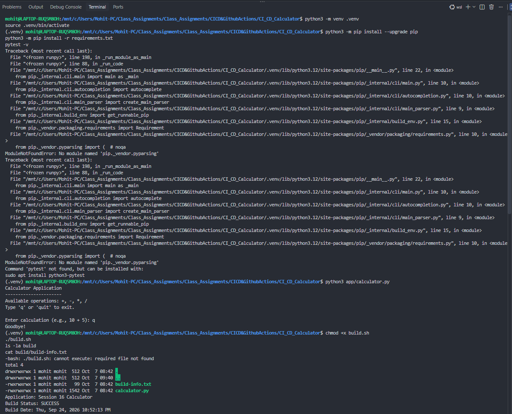
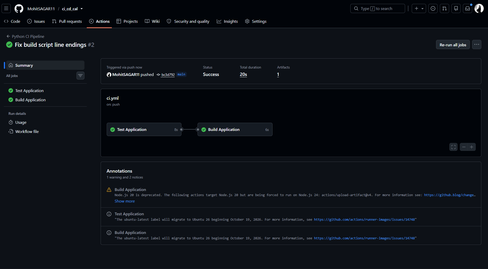

# CI/CD with GitHub Actions

This assignment builds a Python calculator and automates its test and build process with GitHub Actions. Each push to `main` runs the tests first; the build and artifact upload run only after the tests pass.

## Project

The working project is in [`CI_CD_Calculator`](CI_CD_Calculator/).

```text
CI_CD_Calculator/
├── app/calculator.py              # calculator application
├── tests/test_calculator.py       # pytest test suite
├── requirements.txt               # Python dependencies
├── build.sh                       # creates the build output
├── .github/workflows/ci.yml       # GitHub Actions workflow
└── .gitignore
```

## Pipeline flow

```text
git push
   |
   v
GitHub Actions
   |
   +--> Test Application
   |      - install pytest
   |      - run 5 tests
   |
   +--> Build Application (only after tests pass)
          - run build.sh
          - upload calculator-build artifact
```

## Run locally in WSL / Ubuntu

Open the project directory:

```bash
cd "/mnt/c/Users/Mohit-PC/Class_Assignments/Class_Assignments/CICD&GithubActions/CI_CD_Calculator"
```

Create a correctly named virtual environment. Do not use the placeholder `path/to/venv` literally.

```bash
python3 -m venv .venv
source .venv/bin/activate
python3 -m pip install --upgrade pip
python3 -m pip install -r requirements.txt
```

Run the automated tests:

```bash
pytest -v
```

Expected result: **5 passed**.

Run the calculator interactively:

```bash
python3 app/calculator.py
```

Examples: `10 + 5`, `3*5`, and `10 / 2`. Enter `q` to exit.

## Build the application

```bash
chmod +x build.sh
./build.sh
ls -la build
cat build/build-info.txt
```

The build produces:

```text
build/
├── calculator.py
└── build-info.txt
```

If WSL or GitHub Actions reports `cannot execute: required file not found`, `build.sh` has Windows CRLF line endings. Fix it, then commit the change:

```bash
sed -i 's/\r$//' build.sh
chmod +x build.sh
./build.sh
git add build.sh
git commit -m "Fix build script line endings"
git push
```

**Screenshot 1 — Local development and build troubleshooting:** It shows environment setup, calculator execution, and the original CRLF line-ending error in `build.sh`.



## GitHub Actions workflow

The workflow at `.github/workflows/ci.yml` runs on pushes and pull requests to `main`; it can also be run manually. It has two jobs:

| Job | Purpose |
| --- | --- |
| `test` | Installs dependencies and runs `pytest -v`. |
| `build` | Depends on `test`, runs `build.sh`, and uploads the build artifact. |

The workflow uses `needs: test`, so a failed test job prevents the build job from starting.

## Push and verify

```bash
git add .
git commit -m "Add calculator CI pipeline"
git branch -M main
git push -u origin main
```

On GitHub, open **Actions** → **Python CI Pipeline**. A successful run shows both **Test Application** and **Build Application** in green, with one `calculator-build` artifact available to download.

**Screenshot 2 — Successful GitHub Actions run:** Both the test and dependent build jobs pass, and the pipeline publishes one build artifact.



## Key takeaways

- **Continuous Integration (CI)** automatically validates each code change through tests.
- **Continuous Delivery (CD)** makes a verified build available as an artifact.
- Artifacts hold generated build output; Git stores the source code and workflow definition.
- A pipeline that fails when a test fails prevents broken code from reaching the build stage.
