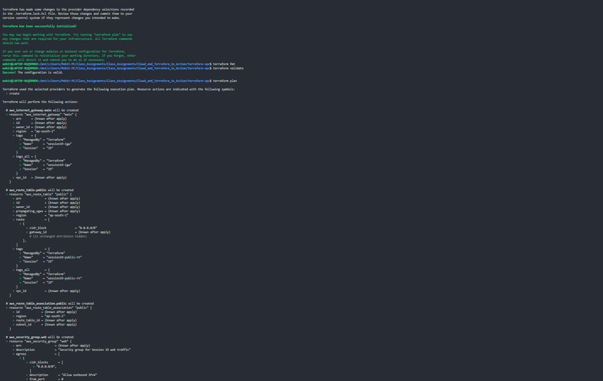
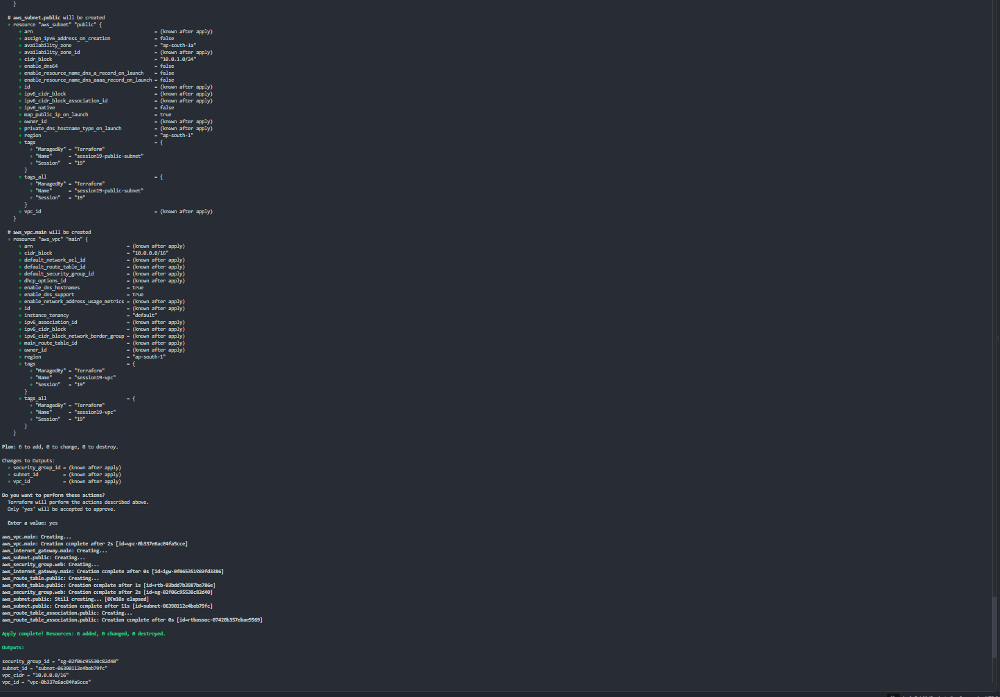
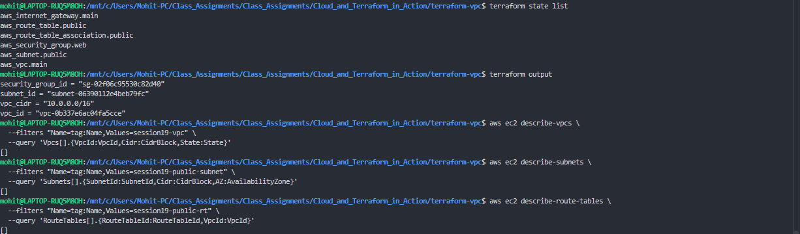
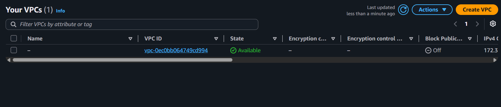
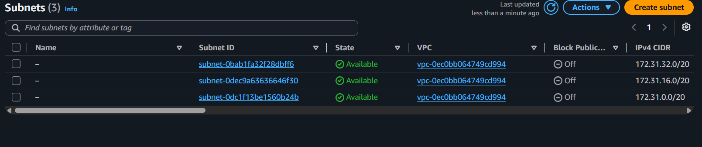
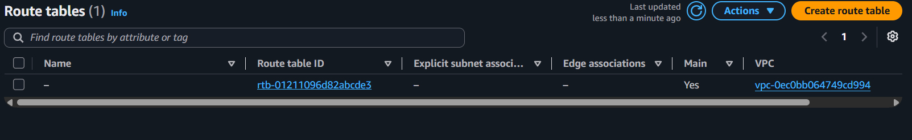

# Cloud and Terraform in Action

This assignment uses Terraform to define a basic AWS network: a VPC, public subnet, Internet Gateway, public route table, route-table association, and web security group.

## Project

The Terraform configuration is in [`terraform-vpc`](terraform-vpc/).

```text
terraform-vpc/
├── versions.tf                 # Terraform and AWS provider requirements
├── variables.tf                # input variables
├── terraform.tfvars.example    # example regional configuration
├── main.tf                     # VPC networking resources
├── outputs.tf                  # IDs and CIDR output values
└── README.md                   # detailed lab instructions
```

## Architecture

```text
Internet
   |
Internet Gateway
   |
VPC: 10.0.0.0/16
   |
Public subnet: 10.0.1.0/24
   |
Public route table + web security group
```

No EC2 instance is created, which keeps the lab focused on networking and avoids compute charges.

## Run the lab

From the project directory:

```bash
cd terraform-vpc
cp terraform.tfvars.example terraform.tfvars
terraform init
terraform fmt
terraform validate
terraform plan
terraform apply
```

Review the plan before approving it. When Terraform prompts for confirmation, type `yes` only after the resources and region are correct.

## Results and evidence

### 1. Terraform initialization, validation, and plan

Terraform initializes the AWS provider, formats and validates the configuration, then plans the VPC networking resources to be created.



### 2. Terraform apply

The apply output shows the public subnet, VPC, Internet Gateway, route table, route-table association, and security group being created. The result reports six resources added and provides output IDs.



### 3. Terraform state and output inspection

`terraform state list` displays the six managed resources, while `terraform output` displays the VPC, subnet, and security-group identifiers.

The AWS CLI filters shown at the bottom return empty lists, so they do **not** verify that the tagged Session 19 resources are currently present. Re-run the describe commands after a successful apply and before cleanup to verify them.



### 4. AWS console: default VPC

This console screenshot shows the account's available default VPC (`172.31.0.0/16`). It is not the Terraform lab VPC, whose planned CIDR is `10.0.0.0/16` and whose tag should be `session19-vpc`.



### 5. AWS console: default subnets

This screenshot shows the default subnets belonging to the default VPC. The Terraform lab should instead show a subnet named `session19-public-subnet` with CIDR `10.0.1.0/24`.



### 6. AWS console: default route table

This is the main route table of the default VPC. The Terraform-created route table should be tagged `session19-public-rt` and associated with the Session 19 VPC.



## Verify the Terraform-created resources

After a successful apply, use these commands to locate the correctly tagged resources:

```bash
aws ec2 describe-vpcs \
  --filters "Name=tag:Name,Values=session19-vpc" \
  --query 'Vpcs[].{VpcId:VpcId,Cidr:CidrBlock,State:State}'

aws ec2 describe-subnets \
  --filters "Name=tag:Name,Values=session19-public-subnet" \
  --query 'Subnets[].{SubnetId:SubnetId,Cidr:CidrBlock,AZ:AvailabilityZone}'

aws ec2 describe-route-tables \
  --filters "Name=tag:Name,Values=session19-public-rt" \
  --query 'RouteTables[].{RouteTableId:RouteTableId,VpcId:VpcId}'
```

## Access requirement

The IAM user must have permissions-boundary approval for `ec2:CreateVpc` and the other VPC networking actions. `AmazonVPCFullAccess` does not override a restrictive permissions boundary.

## Cleanup

Destroy the lab resources after verification to avoid charges:

```bash
terraform plan -destroy
terraform destroy
```
