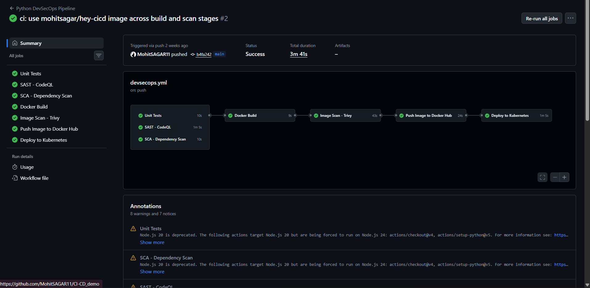

# DevSecOps Pipeline

This assignment extends CI/CD with automated security checks. The Python web application is tested, scanned for code and dependency vulnerabilities, built into a Docker image, scanned again, published to Docker Hub, and deployed to Kubernetes only after the preceding checks succeed.

## Project

The implementation is in [`CI-CD_Pipeline`](CI-CD_Pipeline/).

```text
CI-CD_Pipeline/
├── app/                         # Flask web application
├── tests/                       # automated tests
├── requirements.txt             # runtime dependencies
├── requirements-dev.txt         # test dependencies
├── Dockerfile                   # application container image
├── k8s/                         # Deployment and Service manifests
├── .github/workflows/
│   └── devsecops.yml            # GitHub Actions pipeline
└── SECURITY.md                  # security policy
```

## Pipeline architecture

```text
Push or pull request to main
          |
          +--> Unit Tests
          +--> SAST: CodeQL
          +--> SCA: pip-audit
                    |
                    v
              Docker Build
                    |
                    v
           Image Scan: Trivy
                    |
                    v
       Push Image to Docker Hub
                    |
                    v
     Deploy to Kubernetes (push to main only)
```

The first three jobs run independently. The Docker build waits for all three security gates. Every later stage depends on the previous one, so a failure prevents an unsafe image from being published or deployed.

## Security controls

| Stage | Tool | Purpose |
| --- | --- | --- |
| Unit tests | `pytest` and `pytest-cov` | Validate application behaviour and show test coverage. |
| SAST | CodeQL | Analyze the Python source code for security issues. |
| SCA | `pip-audit` | Check Python dependencies for known vulnerabilities. |
| Container build | Docker | Package the application into a reproducible image. |
| Image scan | Trivy | Scan the built image for high- and critical-severity vulnerabilities. |
| Deployment | Kind + `kubectl` | Verify the container can run successfully in Kubernetes. |

## Run locally in WSL / Ubuntu

```bash
cd "/mnt/c/Users/Mohit-PC/Class_Assignments/Class_Assignments/DevSecOps/CI-CD_Pipeline"
python3 -m venv .venv
source .venv/bin/activate
python3 -m pip install --upgrade pip
python3 -m pip install -r requirements-dev.txt
pytest --cov=app --cov-report=term-missing
```

To run the Flask application locally, use the project README's application command after activating the environment.

## GitHub Actions setup

The workflow is located at `.github/workflows/devsecops.yml`. It runs for pushes and pull requests targeting `main`.

Before pushing, configure this repository secret in GitHub:

```text
Repository → Settings → Secrets and variables → Actions

Name:  DOCKERHUB_TOKEN
Value: Docker Hub access token
```

Never commit the token or print it in workflow logs.

On a push to `main`, the deployment job creates a temporary Kind cluster, applies the Kubernetes manifests, waits for the Deployment rollout, and verifies both the website and `/api/status` endpoint with `curl`.

## Successful run

The captured workflow run shows all seven jobs completing successfully:

1. Unit Tests
2. SAST – CodeQL
3. SCA – Dependency Scan
4. Docker Build
5. Image Scan – Trivy
6. Push Image to Docker Hub
7. Deploy to Kubernetes

**Screenshot — Successful DevSecOps pipeline:** Unit testing, CodeQL, dependency scanning, Docker build, Trivy image scanning, Docker Hub publishing, and Kubernetes deployment all completed successfully.



## Verification checklist

- Unit tests pass and coverage is reported.
- CodeQL analysis completes without blocking findings.
- `pip-audit` reports no blocking dependency vulnerabilities.
- Trivy completes the high/critical image scan.
- The Docker image is pushed with both the commit-SHA tag and `latest` tag.
- The Kubernetes Deployment becomes ready and its Service responds in CI.

## Key takeaway

DevSecOps moves security checks into the delivery pipeline. Instead of checking security only after release, every code change is tested and scanned before it can be packaged, published, and deployed.
