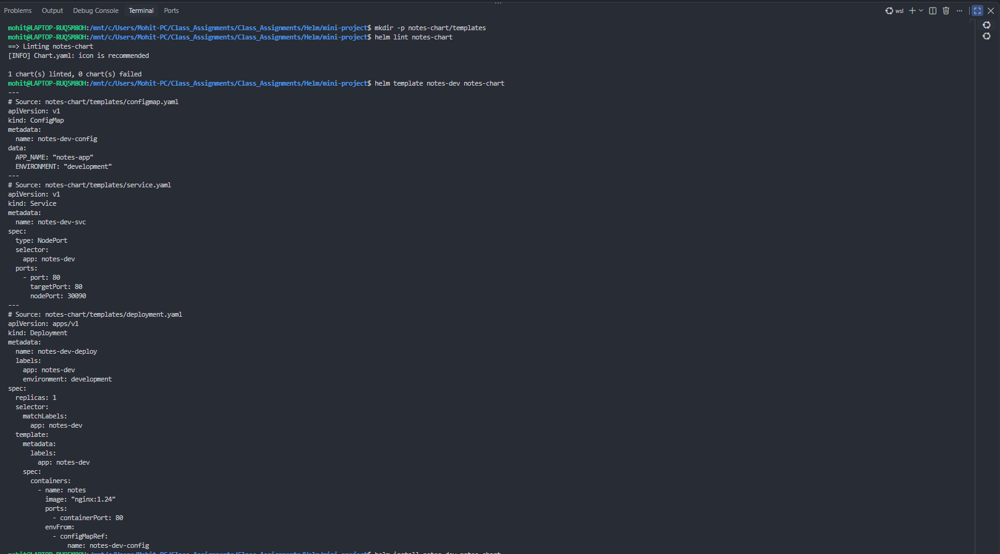
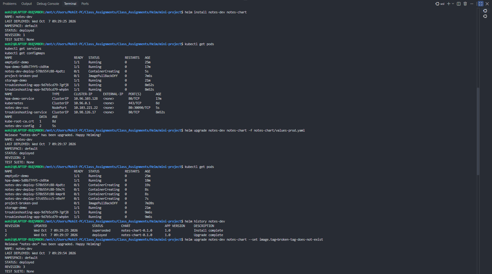
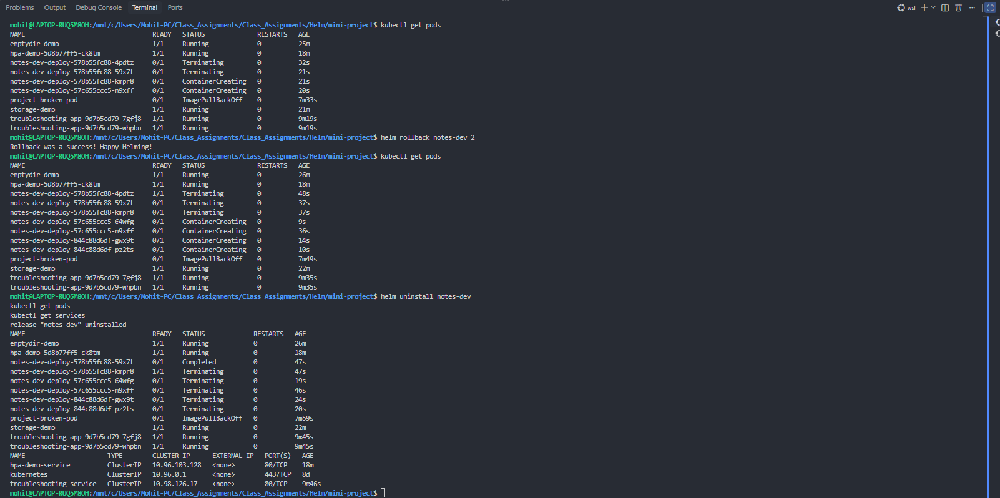

# Helm: Charts, Releases, and Rollbacks

This assignment introduces Helm as the package manager for Kubernetes. It covers chart structure, reusable configuration, templating, release management, upgrades, rollbacks, and a complete Notes application deployment.

## Learning path

| Folder | Topic |
| --- | --- |
| `01-what-is-helm` | Helm concepts, repositories, and releases |
| `02-helm-charts` | Create, render, install, and remove a chart |
| `03-chart-structure` | `Chart.yaml`, `values.yaml`, and `templates/` |
| `04-chart-yaml` | Chart metadata and versioning |
| `05-values-yaml` | Default and environment-specific values |
| `06-templates` | Go-template variables and conditionals |
| `07-install-upgrade` | Install, upgrade, and release revisions |
| `08-rollback` | Recover a release by returning to a prior revision |
| `09-deploying-application` | Build and deploy a complete application chart |
| `mini-project` | Package and deploy the Notes application |

## Prerequisites

- A running Kubernetes cluster and working `kubectl` configuration
- Helm 3 installed

```bash
helm version
kubectl get nodes
```

## Essential Helm concepts

| Term | Meaning |
| --- | --- |
| **Chart** | A reusable package of Kubernetes templates and default configuration. |
| **Release** | A named installed instance of a chart in a cluster. |
| **Values** | Configuration supplied to chart templates. |
| **Revision** | A version in a release's install/upgrade/rollback history. |

Configuration precedence, from lowest to highest, is:

```text
values.yaml -> -f custom-values.yaml -> --set key=value
```

## Mini-project: Notes application

The `mini-project/notes-chart` chart deploys:

```text
notes-chart/
├── Chart.yaml                 # chart metadata
├── values.yaml                # development defaults
├── values-prod.yaml           # production overrides
└── templates/
    ├── configmap.yaml
    ├── deployment.yaml
    └── service.yaml
```

### 1. Validate and render the chart

From `mini-project/`, validate the chart and preview the Kubernetes resources without deploying them:

```bash
helm lint notes-chart
helm template notes-dev notes-chart
```

**Screenshot 1 — Chart validation and rendering:** `helm lint` passes, and `helm template` renders the ConfigMap, Service, and Deployment using the supplied values.


### 2. Install and verify the development release

```bash
helm install notes-dev notes-chart
kubectl get pods
kubectl get services
kubectl get configmaps
```

The initial installation creates revision 1. The screenshot shows the release being installed and the Notes resources created by the chart.

### 3. Upgrade with production values

Apply the production values file, which changes the image tag and scales the application to three replicas:

```bash
helm upgrade notes-dev notes-chart -f notes-chart/values-prod.yaml
helm history notes-dev
kubectl get pods
```

This creates revision 2. A healthy upgrade should eventually show three ready Notes Pods.

### 4. Simulate and recover from a bad release

Use an invalid image tag to demonstrate a failed application rollout:

```bash
helm upgrade notes-dev notes-chart --set image.tag=broken-tag-does-not-exist
kubectl get pods
```

The affected Pods show `ImagePullBackOff` because the specified image tag cannot be pulled. Recover by rolling back to the known-good production revision:

```bash
helm rollback notes-dev 2
kubectl get pods
```

**Screenshot 2 — Install, upgrade, and failed-image test:** The release is installed, upgraded with production values, and then deliberately updated with an invalid image tag.


**Screenshot 3 — Rollback and cleanup:** The release is rolled back to the known-good revision and then uninstalled.


## Useful commands

```bash
# Validate and preview
helm lint <chart-directory>
helm template <release-name> <chart-directory>

# Manage releases
helm install <release-name> <chart-directory>
helm upgrade <release-name> <chart-directory> -f <values-file>
helm upgrade --install <release-name> <chart-directory>
helm list
helm history <release-name>
helm rollback <release-name> <revision>
helm uninstall <release-name>
```

For safer deployments, `--atomic` rolls back an unsuccessful upgrade automatically:

```bash
helm upgrade notes-dev notes-chart --atomic --timeout 60s
```

## Verification checklist

- `helm lint notes-chart` reports no errors.
- `helm template notes-dev notes-chart` renders valid Kubernetes YAML.
- `helm install` creates a deployed release at revision 1.
- `helm upgrade -f values-prod.yaml` creates revision 2 and scales to the configured replica count.
- `helm history notes-dev` shows the release history.
- A rollback returns the chart to a healthy revision.

## Cleanup

Remove every resource created by the release:

```bash
helm uninstall notes-dev
kubectl get pods
kubectl get services
```
