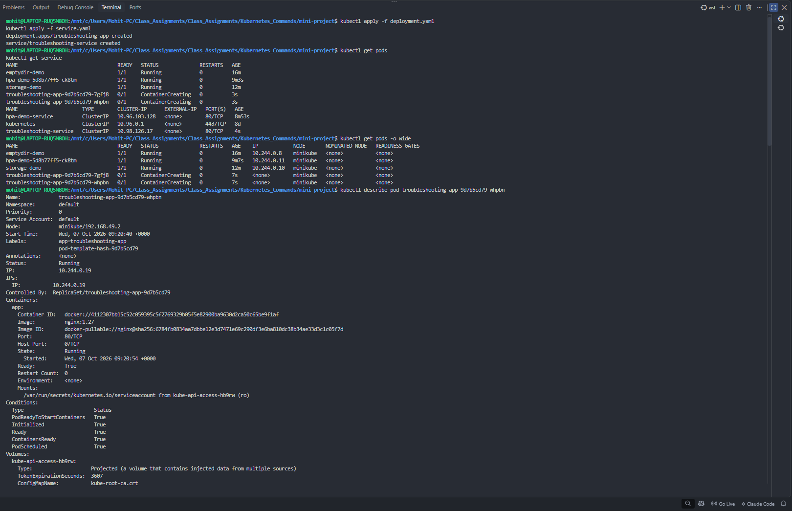
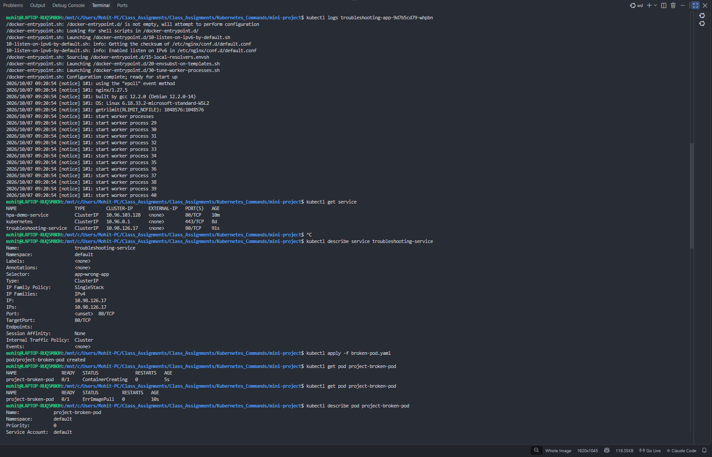
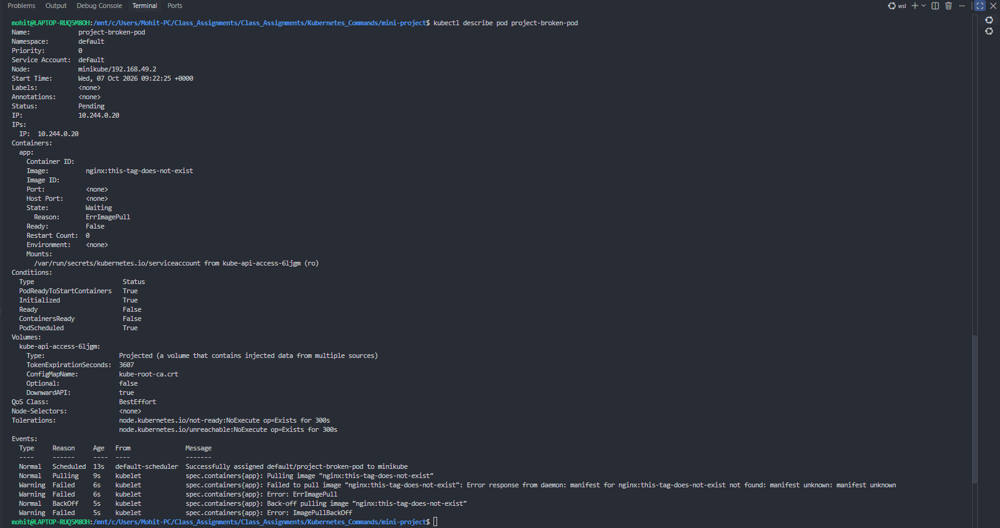

# Kubernetes Commands and Troubleshooting

This assignment is a practical guide to inspecting, debugging, and validating Kubernetes workloads with `kubectl`.

## Contents

| Folder | Topic |
| --- | --- |
| `01-kubectl-get` | List resources and inspect status |
| `02-kubectl-describe` | Investigate resource details and events |
| `03-kubectl-logs` | Read container output |
| `04-kubectl-exec` | Run commands inside a running container |
| `05-events` | Inspect cluster events |
| `06-crashloopbackoff` | Diagnose a repeatedly crashing container |
| `07-imagepullbackoff` | Diagnose an image-pull failure |
| `08-pending-pods` | Investigate scheduling failures |
| `09-service-dns-troubleshooting` | Debug Service selectors, endpoints, and DNS |
| `mini-project` | End-to-end troubleshooting exercise |

## Prerequisites

- A running Kubernetes cluster (such as Minikube or Docker Desktop Kubernetes)
- `kubectl` configured to communicate with it

```bash
kubectl cluster-info
kubectl get nodes
```

## Troubleshooting workflow

Use this order when a workload fails:

```text
get -> describe -> events -> logs -> exec -> fix -> verify
```

```bash
kubectl get pods
kubectl describe pod <pod-name>
kubectl get events --sort-by=.lastTimestamp
kubectl logs <pod-name>
kubectl exec -it <pod-name> -- sh
```

For Service problems, inspect the selector and endpoints as well:

```bash
kubectl describe service <service-name>
kubectl get endpoints <service-name>
kubectl get pods --show-labels
```

## Mini-project

From `mini-project/`, deploy the application and Service:

```bash
kubectl apply -f deployment.yaml
kubectl apply -f service.yaml
kubectl get pods -o wide
kubectl get service
```

**Screenshot 1 — Deployment and Pod inspection:** The application Pods are listed and `kubectl describe pod` shows the Nginx container details.


**Screenshot 2 — Logs and Service diagnosis:** Nginx startup logs are displayed and the Service details show that no endpoints are selected.


Create the intentionally broken Pod and inspect its events:

```bash
kubectl apply -f broken-pod.yaml
kubectl get pod project-broken-pod
kubectl describe pod project-broken-pod
```

**Screenshot 3 — Invalid image troubleshooting:** The Pod events identify the invalid image tag and the resulting `ErrImagePull` failure.


Fix the manifest with a valid Nginx tag, then recreate or reapply the workload.

## Questions and answers

1. **What does `kubectl get` tell us?**  
   It gives a quick, current summary of resources. For Pods, it shows readiness, status, restarts, and age.

2. **What is the difference between `get` and `describe`?**  
   `get` is a concise status view. `describe` is a detailed diagnostic view containing configuration, labels, container state, conditions, and recent events.

3. **Why do we use `kubectl logs`?**  
   It reads a container's output and error streams to identify application errors or confirm startup. Use `--previous` when the container restarted.

4. **When would you use `kubectl exec`?**  
   Use it with a running container to inspect files, environment variables, DNS resolution, or the application response from inside the Pod.

5. **What does `CrashLoopBackOff` mean?**  
   The container repeatedly starts and fails; Kubernetes delays retry attempts. It is a symptom, so inspect logs and events for the cause.

6. **What does `ImagePullBackOff` mean?**  
   Kubernetes cannot download the image and is backing off before retrying. Causes include a wrong image name/tag, registry access issues, or missing credentials. Here, the image tag does not exist.

7. **Why can a Pod remain `Pending`?**  
   The scheduler cannot place it on a node. Causes include insufficient resources, incompatible selectors or taints, unbound PVCs, or unavailable nodes. Check events.

8. **Why can a Service have no endpoints?**  
   No ready Pod matches its selector. This can result from label-selector mismatch, unready Pods, different namespaces, or no matching Pods.

9. **What is the relationship between a Service selector and Pod labels?**  
   A Service routes only to ready Pods whose labels match every selector label. A mismatch leaves the Service without backends.

10. **What is Kubernetes DNS?**  
    Kubernetes DNS, normally CoreDNS, lets workloads reach Services by name rather than IP address, for example `http://troubleshooting-service` within the same namespace.

## Cleanup

```bash
kubectl delete -f broken-pod.yaml --ignore-not-found
kubectl delete -f service.yaml --ignore-not-found
kubectl delete -f deployment.yaml --ignore-not-found
```
