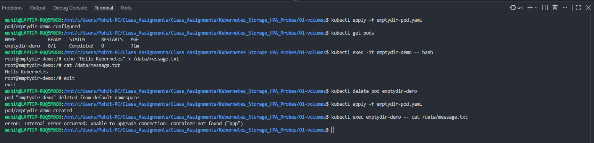
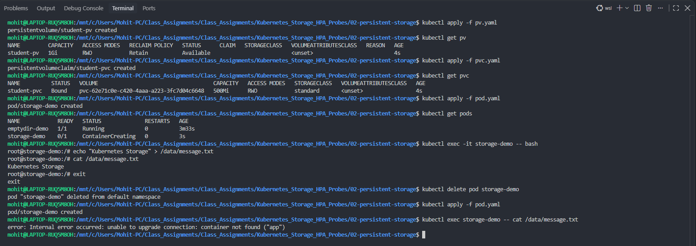
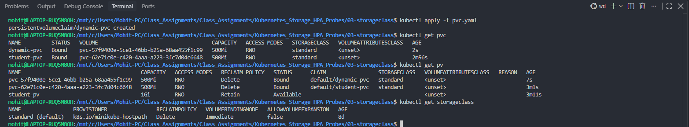
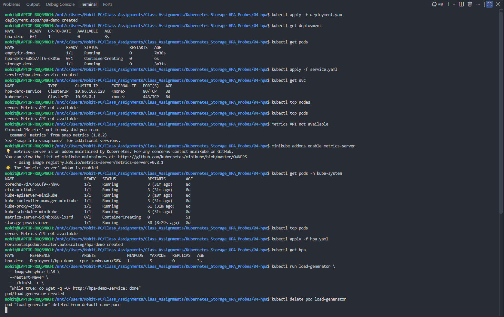
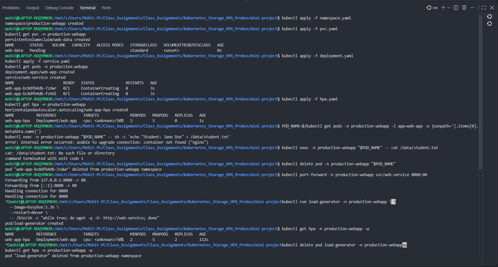

# Kubernetes Storage, HPA, and Probes

This assignment covers temporary and persistent storage, dynamic provisioning, Horizontal Pod Autoscaling (HPA), and container health probes.

## Contents

| Folder | Topic |
| --- | --- |
| `01-volumes` | `emptyDir` and `hostPath` volumes |
| `02-persistent-storage` | PersistentVolumes (PV), PersistentVolumeClaims (PVC), and Pods |
| `03-storageclass` | Dynamic storage provisioning with a StorageClass |
| `04-hpa` | CPU-based Horizontal Pod Autoscaling |
| `05-probes` | Startup, readiness, and liveness probes |
| `mini-project` | Production-style web application combining all concepts |

## Prerequisites

- A running Kubernetes cluster and configured `kubectl`
- A default StorageClass: `kubectl get storageclass`
- Metrics Server for HPA metrics. With Minikube:

```bash
minikube addons enable metrics-server
kubectl get pods -n kube-system
kubectl top pods
```

`kubectl top` may initially show `Metrics API not available` while Metrics Server starts. Wait until it is running and retry.

## 1. Volume lifecycle: `emptyDir`

From `01-volumes/`, apply the example, write a file, delete the Pod, and recreate it:

```bash
kubectl apply -f emptydir-pod.yaml
kubectl exec -it emptydir-demo -- sh
echo "Hello Kubernetes" > /data/message.txt
cat /data/message.txt
exit
kubectl delete pod emptydir-demo
kubectl apply -f emptydir-pod.yaml
```

**Screenshot 1 — `emptyDir` lifecycle:** The file exists before the Pod is deleted; after recreation, the `emptyDir` data is no longer available.


## 2. Persistent storage: PV, PVC, and Pod

From `02-persistent-storage/`, create the volume, claim, and consumer Pod:

```bash
kubectl apply -f pv.yaml
kubectl apply -f pvc.yaml
kubectl get pv
kubectl get pvc
kubectl apply -f pod.yaml
```

Write a file under `/data`, delete and recreate the Pod, then read it again. Unlike `emptyDir`, PV data remains because the PVC keeps storage independent of the Pod lifecycle.

**Screenshot 2 — PV and PVC binding:** The PersistentVolume and PersistentVolumeClaim become `Bound`, enabling the Pod to use persistent storage.


## 3. Dynamic provisioning with a StorageClass

From `03-storageclass/`, apply the PVC and inspect the automatically created PV:

```bash
kubectl apply -f pvc.yaml
kubectl get pvc
kubectl get pv
kubectl get storageclass
```

**Screenshot 3 — Dynamic provisioning:** `dynamic-pvc` is `Bound` and a matching PV was created automatically through the `standard` StorageClass.


## 4. Horizontal Pod Autoscaler

From `04-hpa/`, apply the workload, Service, and autoscaler:

```bash
kubectl apply -f deployment.yaml
kubectl apply -f service.yaml
kubectl apply -f hpa.yaml
kubectl get hpa
```

Generate traffic in a separate terminal and watch scaling:

```bash
kubectl run load-generator --image=busybox:1.36 --restart=Never -- \
  /bin/sh -c "while true; do wget -q -O- http://hpa-demo-service; done"
kubectl get hpa -w
```

Stop the test when finished:

```bash
kubectl delete pod load-generator --ignore-not-found
```

**Screenshot 4 — HPA prerequisites and setup:** Metrics Server is enabled, then an HPA with a 50% CPU target is created and exercised with generated load.


## 5. Mini-project: persistent, scalable web app

The `mini-project/` combines a namespace, PVC, Deployment, Service, HPA, and probes.

```bash
cd mini-project
kubectl apply -f namespace.yaml
kubectl apply -f pvc.yaml
kubectl apply -f deployment.yaml
kubectl apply -f service.yaml
kubectl apply -f hpa.yaml
kubectl get all -n production-webapp
kubectl get pvc,hpa -n production-webapp
```

Verify persistent data using a running `web-app` Pod:

```bash
POD_NAME=$(kubectl get pods -n production-webapp -l app=web-app -o jsonpath='{.items[0].metadata.name}')
kubectl exec -n production-webapp "$POD_NAME" -- sh -c 'echo "Student: Your Name" > /data/student.txt'
kubectl exec -n production-webapp "$POD_NAME" -- cat /data/student.txt
```

Test the Service locally:

```bash
kubectl port-forward -n production-webapp svc/web-service 8080:80
```

Open `http://localhost:8080`.

**Screenshot 5 — Mini-project verification:** The namespace resources, PVC, HPA, Pod access, port forwarding, and load-generation steps are shown together.


## Probe reference

| Probe | Question it answers | Kubernetes action on failure |
| --- | --- | --- |
| Startup probe | Has the application started? | Restarts the container; other probes wait until startup succeeds. |
| Readiness probe | Can this Pod receive traffic? | Removes the Pod from Service endpoints; does not restart it. |
| Liveness probe | Is the container still healthy? | Restarts the container. |

## Troubleshooting checklist

```bash
kubectl get pods
kubectl describe pod <pod-name>
kubectl get events --sort-by=.lastTimestamp
kubectl get pvc,pv
kubectl get hpa
kubectl top pods
```

- PVC `Pending`: check the StorageClass and PVC events.
- HPA shows `<unknown>`: verify Metrics Server and CPU requests in the Deployment.
- Service has no endpoints: verify Pod readiness and label-selector matching.
- Probe failures: inspect the probe path, port, timings, and container logs.

## Cleanup

```bash
kubectl delete -f mini-project/hpa.yaml --ignore-not-found
kubectl delete -f mini-project/service.yaml --ignore-not-found
kubectl delete -f mini-project/deployment.yaml --ignore-not-found
kubectl delete -f mini-project/pvc.yaml --ignore-not-found
kubectl delete -f mini-project/namespace.yaml --ignore-not-found
```
