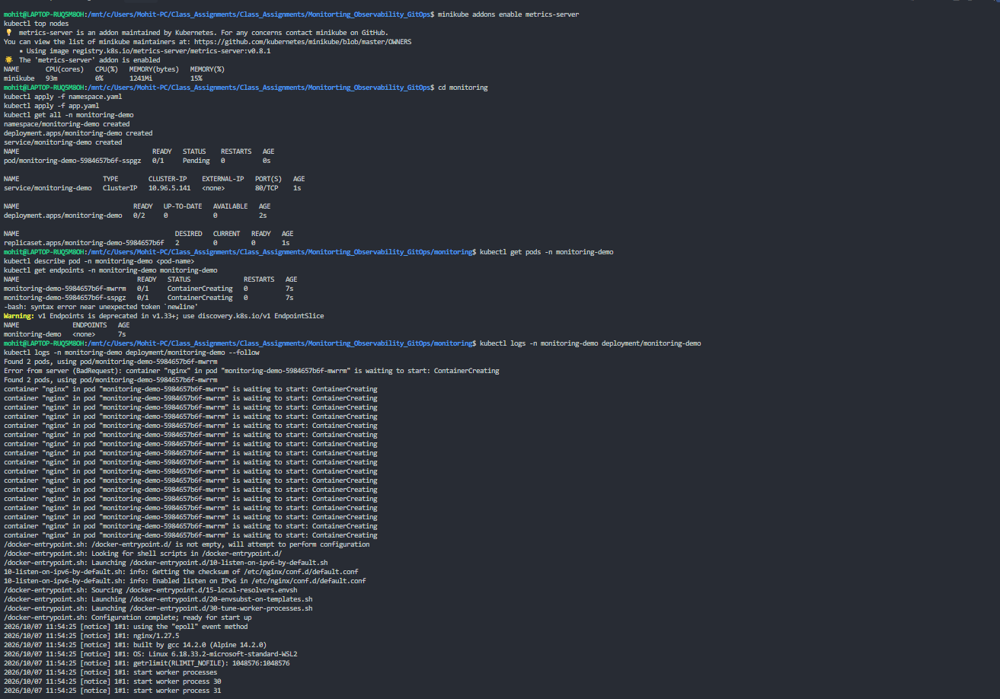
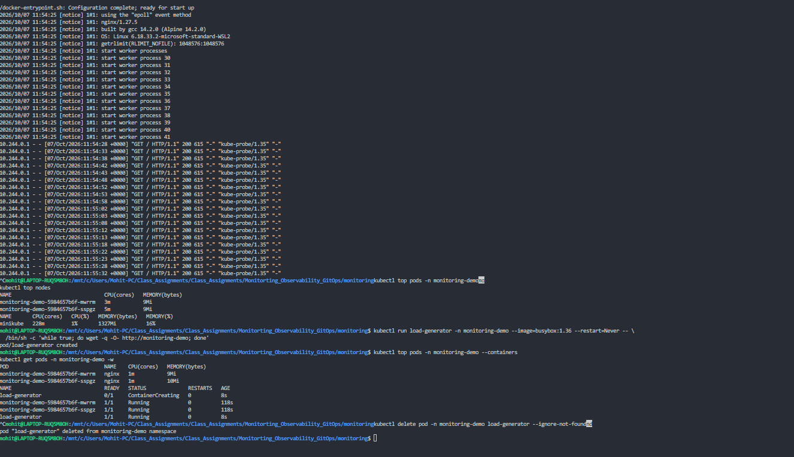

# Monitoring Demo Results

## 1. Metrics Server and application deployment

Metrics Server was enabled in Minikube, allowing `kubectl top` to report node and Pod CPU/memory usage. The `monitoring-demo` namespace, Deployment, and Service were then applied.

The first Pod check occurred while the Nginx containers were still starting (`ContainerCreating`), so the Service initially had no endpoints. The Nginx logs then confirm that both containers started successfully and began returning HTTP `200` responses to Kubernetes health probes.

## 2. Resource usage and controlled load test

`kubectl top pods` shows current CPU and memory utilization for the two Nginx Pods. The container-level view confirms resource measurements are available after Metrics Server was enabled.

A BusyBox `load-generator` Pod was created to make repeated requests to the `monitoring-demo` Service. The application Pods remained `Running`, and the temporary load-generator Pod was deleted after the test.

## Result

The monitoring demo verified these capabilities:

- Application health through readiness/liveness probe responses in Nginx logs
- Application logs through `kubectl logs`
- Pod and node CPU/memory utilization through `kubectl top`
- Controlled request generation through a temporary BusyBox Pod
- Safe cleanup by deleting the load-generator after testing

> The Prometheus alert rule and Argo CD GitOps manifest are documented in the project README. Their results should be added here after Prometheus Operator and Argo CD are configured in the cluster.
