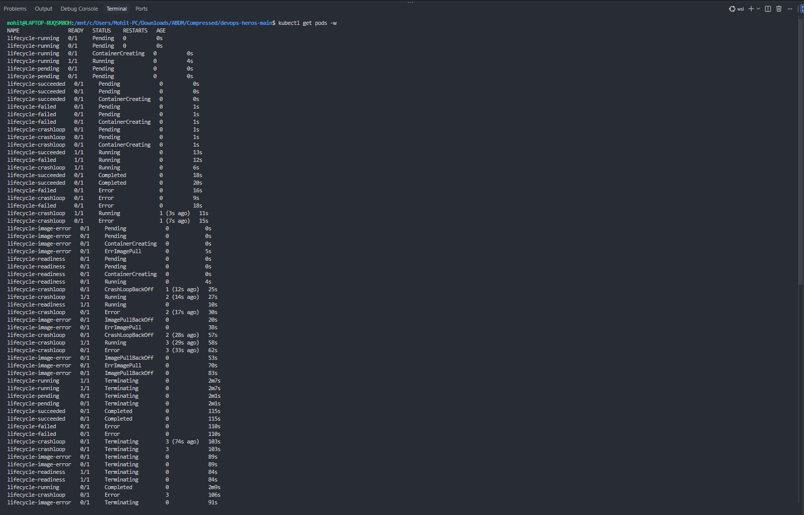
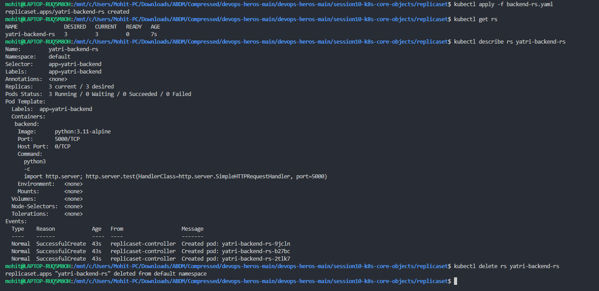
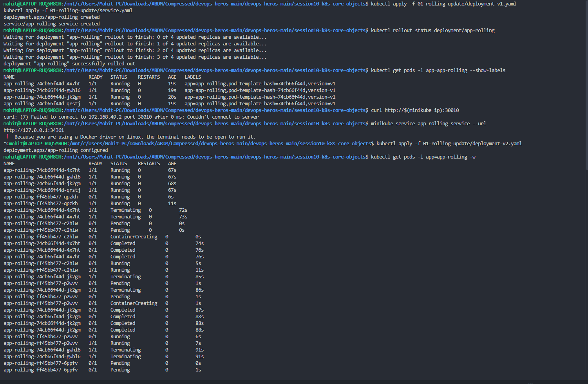
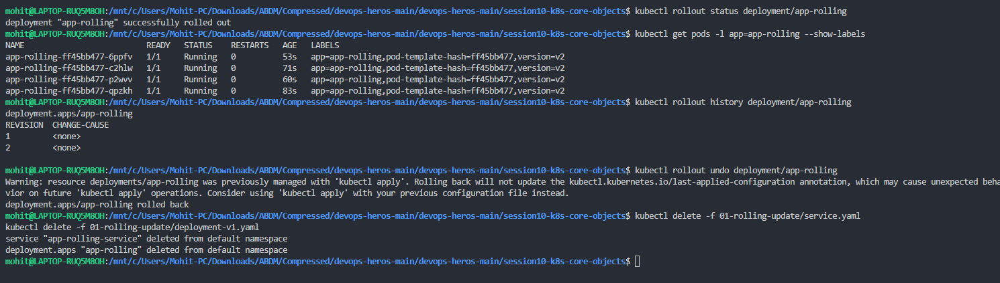
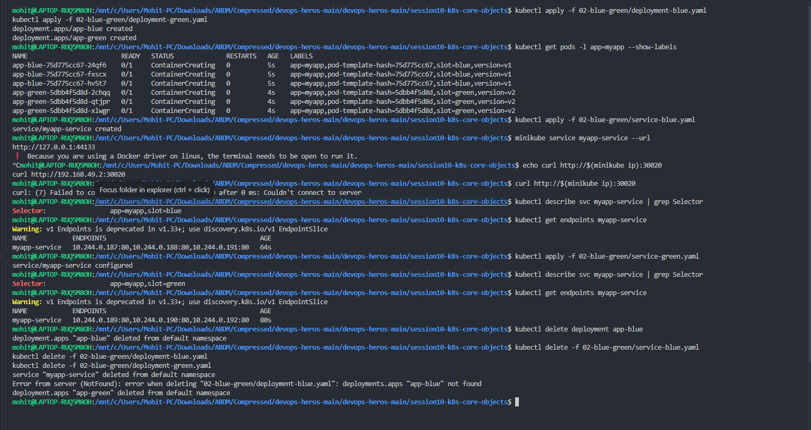
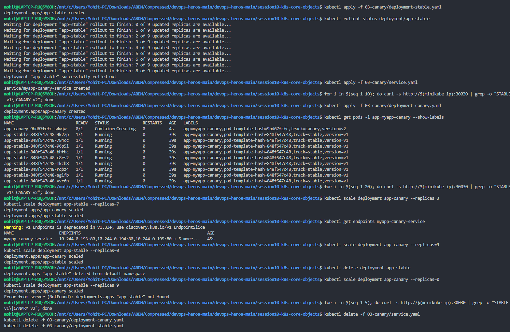
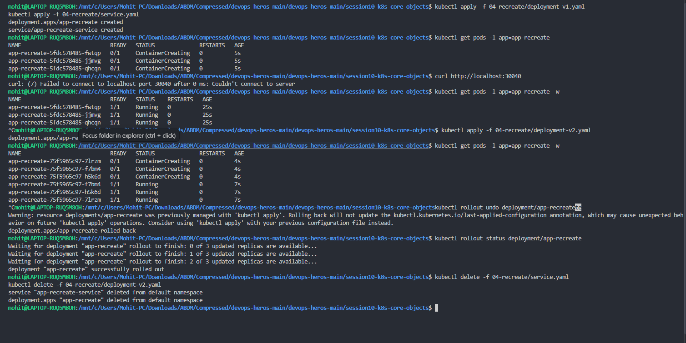

# Pods, ReplicaSets & Deployment Strategies

> **Session 10 — Kubernetes Core Objects**
> **Name:** Mohit Sagar &nbsp;•&nbsp; **Enrollment:** 2024bcs10622
> **Cluster:** minikube v1.35.1 (Docker driver, WSL2) &nbsp;•&nbsp; **Manifests:** [`../k8s/`](../k8s/)

---

## Contents

| # | Task | What it proves | Screenshot |
|:-:|------|----------------|------------|
| 1 | [Pod lifecycle](#1--pod-lifecycle) | Every phase a Pod can be in | `pod-lifecycle.png` |
| 2 | [ReplicaSet](#2--replicaset) | Desired-state reconciliation | `rs.png` |
| 3 | [Rolling Update](#3--rolling-update) | Zero-downtime release + rollback | `rolling1.png`, `rolling2.png` |
| 4 | [Blue-Green](#4--blue-green) | Instant switch via Service selector | `blue-green.png` |
| 5 | [Canary](#5--canary) | Percentage traffic split by replica count | `canary.png` |
| 6 | [Recreate](#6--recreate) | Kill-all-then-start (with downtime) | `recreate.png` |

---

## 1 · Pod Lifecycle

**Goal —** launch one Pod per lifecycle phase and watch the state machine live.

```bash
kubectl apply -f 00-pod-lifecycle/          # 7 pods, one per phase
kubectl get pods -w                         # watch every transition
```



### What the watch shows

| Pod | Path it took | Phase reached |
|-----|--------------|---------------|
| `lifecycle-running` | Pending → ContainerCreating → **Running (1/1)** | `Running` |
| `lifecycle-pending` | **Pending forever** — never scheduled | `Pending` |
| `lifecycle-succeeded` | Running → **Completed** | `Succeeded` |
| `lifecycle-failed` | Running → **Error** (non-zero exit) | `Failed` |
| `lifecycle-crashloop` | Error → Running → Error → **CrashLoopBackOff**, restarts 1 → 2 → 3 | `Running` w/ backoff |
| `lifecycle-image-error` | ContainerCreating → **ErrImagePull** → **ImagePullBackOff** | `Pending` |
| `lifecycle-readiness` | Running but **0/1** for ~10s, then **1/1** | `Running` |

**Key takeaways**

- `STATUS` in `kubectl get pods` is *not* the Pod phase — `CrashLoopBackOff`, `ErrImagePull` and `Completed` are container-level reasons surfaced for humans.
- `READY 0/1` + `STATUS Running` = the container is up but the **readiness probe** has not passed, so the Service will not send it traffic.
- `ErrImagePull` (first attempt) becomes `ImagePullBackOff` (retry with exponential backoff) — the backoff is why the second state lasts much longer.
- The restart counter tells the story: `1 (3s ago)` → `2 (14s ago)` → `3 (29s ago)` — the gaps grow because kubelet backs off 10s, 20s, 40s… up to 5 min.
- The tail of the watch (everything `Terminating`) is `kubectl delete` running — Pods get their `terminationGracePeriodSeconds` before SIGKILL.

---

## 2 · ReplicaSet

**Goal —** create a ReplicaSet and confirm the controller holds 3 replicas.

```bash
kubectl apply -f backend-rs.yaml
kubectl get rs
kubectl describe rs yatri-backend-rs
kubectl delete rs yatri-backend-rs
```



### Result

```
NAME               DESIRED   CURRENT   READY   AGE
yatri-backend-rs   3         3         0       7s
```

`describe` confirms the reconciliation loop:

| Field | Value |
|-------|-------|
| Selector | `app=yatri-backend` |
| Replicas | `3 current / 3 desired` |
| Pods Status | `3 Running / 0 Waiting / 0 Succeeded / 0 Failed` |
| Image | `python:3.11-alpine` running `http.server` on **5000** |
| Events | 3 × `SuccessfulCreate` from `replicaset-controller` → `-9jcln`, `-b27bc`, `-2tlk7` |

> **On `READY 0`** — the ReplicaSet was listed 7 seconds after creation, so containers were still starting. `CURRENT 3 / READY 0` is normal at that age, and `describe` a moment later already reports `3 Running`. A second `kubectl get rs` would show `READY 3`.

**Why you still use Deployments instead —** a ReplicaSet can only keep N pods alive. It has *no* rollout, no revision history, no rollback. A Deployment owns ReplicaSets and gives you all three (see Task 3).

---

## 3 · Rolling Update

**Goal —** upgrade v1 → v2 with **zero downtime**, then roll back.

Strategy in [`deployment-v1.yaml`](../k8s/rolling-update/deployment-v1.yaml): `maxSurge: 1`, `maxUnavailable: 0` — never drop below 4 ready pods, add at most 1 extra.

```bash
kubectl apply -f 01-rolling-update/deployment-v1.yaml -f 01-rolling-update/service.yaml
kubectl rollout status deployment/app-rolling
kubectl get pods -l app=app-rolling --show-labels

kubectl apply -f 01-rolling-update/deployment-v2.yaml     # trigger the rollout
kubectl get pods -l app=app-rolling -w                    # watch the swap
kubectl rollout history deployment/app-rolling
kubectl rollout undo deployment/app-rolling               # back to v1
```




### Result

`rollout status` counts up cleanly — `0 of 4 → 1 of 4 → 2 of 4 → 3 of 4 → successfully rolled out`.

The watch shows the signature rolling pattern: **a new pod reaches `Running` *before* an old one goes `Terminating`.**

```
app-rolling-ff45bb477-qpzkh    1/1   Running       0   11s   <- new (v2) ready first
app-rolling-74cb66f44d-4x7ht   1/1   Terminating   0   73s   <- only then does old go away
```

Two distinct `pod-template-hash` values prove two ReplicaSets are in play:

| ReplicaSet hash | Version | End state |
|---|---|---|
| `74cb66f44d` | `version=v1` | scaled to 0 |
| `ff45bb477`  | `version=v2` | scaled to 4 |

Final state — all 4 pods on `version=v2`, and `rollout history` lists **REVISION 1** and **REVISION 2**.

### ⚠️ Errors in this screenshot

<details open>
<summary><b>1. <code>curl http://$(minikube ip):30010</code> → <code>curl: (7) Failed to connect to 192.168.49.2 port 30010</code></b></summary>

**Why it happened:** minikube is running with the **Docker driver**, so `192.168.49.2` is an address on Docker's internal bridge network. It is not routable from the WSL host shell, so the NodePort is unreachable at that IP even though the Service itself is perfectly healthy.

**What should have been there:** the HTML page showing `VERSION: v1`. Get it with a tunnel instead:

```bash
minikube service app-rolling-service --url    # -> http://127.0.0.1:34361  (keep terminal OPEN)
curl http://127.0.0.1:34361

# or, driver-independent:
kubectl port-forward svc/app-rolling-service 8080:80
curl http://localhost:8080
```

The screenshot does show `minikube service ... --url` returning `http://127.0.0.1:34361` along with the hint *"Because you are using a Docker driver on linux, the terminal needs to be open to run it"* — that hint **is** the explanation. The `^C` that follows killed the tunnel.
</details>

<details open>
<summary><b>2. <code>Warning: resource deployments/app-rolling was previously managed with 'kubectl apply'…</code> on <code>rollout undo</code></b></summary>

**Why it happened:** `rollout undo` patches the live object directly, so the `kubectl.kubernetes.io/last-applied-configuration` annotation still describes v2 while the running pods are v1. A later `kubectl apply` would diff against that stale annotation and could silently re-apply v2.

**What should have been done:** nothing was broken — the rollback succeeded (`deployment.apps/app-rolling rolled back`). For a file-managed Deployment the clean rollback is `kubectl apply -f deployment-v1.yaml`, which keeps the annotation honest.
</details>

---

## 4 · Blue-Green

**Goal —** run v1 (blue) and v2 (green) side by side, then flip 100% of traffic in one step by editing the **Service selector**.

```bash
kubectl apply -f 02-blue-green/deployment-blue.yaml -f 02-blue-green/deployment-green.yaml
kubectl get pods -l app=myapp --show-labels
kubectl apply -f 02-blue-green/service-blue.yaml           # live = blue

kubectl describe svc myapp-service | grep Selector
kubectl get endpoints myapp-service

kubectl apply -f 02-blue-green/service-green.yaml          # THE SWITCH
kubectl describe svc myapp-service | grep Selector
kubectl get endpoints myapp-service
```



### Result — the switch is visible in the endpoints

| Step | Selector | Endpoints |
|------|----------|-----------|
| Before | `app=myapp,slot=blue` | `10.244.0.187:80, 10.244.0.188:80, 10.244.0.191:80` |
| After | `app=myapp,slot=green` | `10.244.0.189:80, 10.244.0.190:80, 10.244.0.192:80` |

Three completely different pod IPs — **no pod restarted, no image pulled**. `kube-proxy` simply rewrote its rules. That is why blue-green rollback is instant: re-apply `service-blue.yaml`.

Cost: 6 pods running to serve 3 pods of capacity — you pay 2× for the duration of the switch window.

### ⚠️ Errors in this screenshot

<details open>
<summary><b>1. <code>curl http://$(minikube ip):30020</code> → <code>curl: (7) Failed to connect</code></b></summary>

Same Docker-driver cause as Task 3. `minikube service myapp-service --url` returned `http://127.0.0.1:44133`, but that URL is alive **only while the tunnel terminal stays open** — the `^C` visible right after is what killed it, so the following curl had nothing to connect to.

**Expected output:** the blue page (`VERSION: v1`) before the switch, and the green page (`VERSION: v2`) after it — the whole point of the exercise.
</details>

<details open>
<summary><b>2. <code>Error from server (NotFound): deployments.apps "app-blue" not found</code></b></summary>

**Why it happened:** `kubectl delete deployment app-blue` ran first, then `kubectl delete -f 02-blue-green/deployment-blue.yaml` tried to delete the same object a second time.

**What should have been there:** `deployment.apps "app-blue" deleted`. Delete once — by name *or* by file, not both. To make repeat cleanup silent:

```bash
kubectl delete -f 02-blue-green/ --ignore-not-found
```
</details>

<details>
<summary><b>3. <code>Warning: v1 Endpoints is deprecated in v1.33+; use discovery.k8s.io/v1 EndpointSlice</code></b></summary>

**Why it happened:** the cluster runs a Kubernetes version where the legacy `Endpoints` API is deprecated in favour of `EndpointSlice`. The output is still correct — this is a heads-up, not a failure.

**Modern equivalent:**

```bash
kubectl get endpointslices -l kubernetes.io/service-name=myapp-service
```
</details>

---

## 5 · Canary

**Goal —** send a small slice of traffic to v2 by **replica ratio**, then ramp 10% → 30% → 100%.

Both Deployments carry `app: myapp-canary`, so a single Service selects **both**; the split is nothing more than pod counts.

```bash
kubectl apply -f 03-canary/deployment-stable.yaml -f 03-canary/service.yaml   # 9 stable
kubectl apply -f 03-canary/deployment-canary.yaml                             # +1 canary = 10%

for i in $(seq 1 20); do curl -s http://$(minikube ip):30030 | grep -o "STABLE v1\|CANARY v2"; done

kubectl scale deployment app-canary --replicas=3        # ramp to 30%
kubectl scale deployment app-stable --replicas=7
kubectl get endpoints myapp-canary-service

kubectl scale deployment app-canary --replicas=9        # full promotion
kubectl scale deployment app-stable --replicas=0
kubectl delete deployment app-stable
```



### Result

`rollout status` for the stable set counts `0 of 9 … 8 of 9 → successfully rolled out`. After the canary lands, the labels show the split clearly:

```
app-canary-9bd67fcfc-s4wjw    0/1  ContainerCreating  track=canary,version=v2   <- 1 pod
app-stable-848f547c48-4k2zp   1/1  Running            track=stable,version=v1   <- 9 pods
... (8 more stable)
```

| Stage | canary replicas | stable replicas | Traffic to v2 |
|-------|:---------------:|:---------------:|:-------------:|
| Baseline | 0 | 9 | 0% |
| Canary in | 1 | 9 | ~10% |
| Ramp | 3 | 7 | ~30% |
| Promote | 9 | 0 | 100% |

`kubectl get endpoints myapp-canary-service` returns `10.244.0.193:80, 10.244.0.194:80, 10.244.0.195:80 + 5 more` — one Service fronting **both** tracks, which is precisely the mechanism doing the split.

### ⚠️ Errors in this screenshot

<details open>
<summary><b>1. All three <code>for i in $(seq 1 N); do curl … done</code> loops printed nothing at all</b></summary>

**Why it happened:** every `curl` inside the loop failed exactly like Task 3 — `$(minikube ip)` is unreachable from the host under the Docker driver. `grep` then received an empty body and matched nothing, so the loop produced **zero output**. This is a *silent* failure, which is worse than a loud one: the prompt comes straight back and it looks like the command worked.

**What should have been there:** roughly a 1-in-10 mix —

```
STABLE v1
STABLE v1
CANARY v2     <- ~1 in 10
STABLE v1
...
```

**How to actually get it:**

```bash
kubectl port-forward svc/myapp-canary-service 8080:80 &
for i in $(seq 1 20); do curl -s http://localhost:8080 | grep -o "STABLE v1\|CANARY v2"; done | sort | uniq -c
```

The trailing `| sort | uniq -c` is what makes the ratio readable at a glance (`18 STABLE v1`, `2 CANARY v2`).

> **Caveat worth knowing:** this split is only *statistically* 10%. `kube-proxy` load-balances per **connection**, not per request, so a client reusing a keep-alive connection can land on the same pod every time. For true request-level percentages you need an ingress controller or a service mesh.
</details>

<details open>
<summary><b>2. <code>Error from server (NotFound): deployments.apps "app-stable" not found</code></b></summary>

**Why it happened:** `kubectl delete deployment app-stable` was run *before* `kubectl scale deployment app-stable --replicas=9`. Once the object is deleted there is nothing left to scale.

**What should have been done:** scale down to 0 first, verify, *then* delete — or simply drop the stray scale command:

```bash
kubectl scale deployment app-stable --replicas=0
kubectl get pods -l track=stable        # confirm empty
kubectl delete deployment app-stable
```
</details>

---

## 6 · Recreate

**Goal —** show the opposite of a rolling update: **all old pods die, then new ones start.** Downtime is expected and is the point.

```bash
kubectl apply -f 04-recreate/deployment-v1.yaml -f 04-recreate/service.yaml
kubectl get pods -l app=app-recreate -w
kubectl apply -f 04-recreate/deployment-v2.yaml
kubectl get pods -l app=app-recreate -w
kubectl rollout undo deployment/app-recreate
kubectl rollout status deployment/app-recreate
```



### Result

v1 settles at 3 × `Running`, then applying v2 produces a **brand-new pod-template-hash with all three pods in `ContainerCreating` simultaneously**:

```
app-recreate-5fdc578485-*        1/1  Running                    <- v1, all three
app-recreate-75f5965c97-7lrzm    0/1  ContainerCreating   0  4s
app-recreate-75f5965c97-f7bm4    0/1  ContainerCreating   0  4s
app-recreate-75f5965c97-h5k6d    0/1  ContainerCreating   0  4s  <- v2, all three at once
```

That simultaneity **is** the Recreate signature. Under `RollingUpdate` you would never see the whole old set torn down with zero new pods ready; here there is a real gap of a few seconds where the Service has **no endpoints** and clients get connection refused.

| Strategy | Old pods | New pods | Downtime | Extra capacity needed |
|----------|----------|----------|:--------:|:---------------------:|
| `RollingUpdate` | drained one at a time | added before old removed | **none** | yes (maxSurge) |
| `Recreate` | **all killed first** | started afterwards | **yes** | none |

Use `Recreate` when two versions genuinely cannot coexist — an incompatible DB schema migration, or a `ReadWriteOnce` volume only one pod can mount.

### ⚠️ Error in this screenshot

<details open>
<summary><b><code>curl http://localhost:30040</code> → <code>curl: (7) Failed to connect to localhost port 30040</code></b></summary>

**Why it happened:** a NodePort is published on the **node's** address, and the node here is the minikube container — not the WSL host. Nothing is listening on `localhost:30040` on the host side. (It is the right instinct at the wrong layer: with the Docker driver, `minikube service` maps the NodePort to a *random* `127.0.0.1:<port>`, never to 30040 itself.)

**What should have been there:** the v1 HTML page. Reach it with:

```bash
minikube service app-recreate-service --url     # keep the terminal open
# or
kubectl port-forward svc/app-recreate-service 30040:80
curl http://localhost:30040
```
</details>

---

## The one lesson: reaching a Service on minikube + Docker driver

Four of the six tasks failed at the same step, always for the same reason. Worth stating once:

| What you try | Works? | Why |
|---|:---:|---|
| `curl $(minikube ip):<nodePort>` | ❌ | Node IP lives inside Docker's network namespace |
| `curl localhost:<nodePort>` | ❌ | Nothing is bound on the host at that port |
| `minikube service <svc> --url` | ✅ | Opens a tunnel — **terminal must stay open** |
| `kubectl port-forward svc/<svc> 8080:80` | ✅ | Works on every driver and every cluster |
| `minikube tunnel` (for `LoadBalancer`) | ✅ | Needs root, must keep running |

**Rule of thumb:** for assignments and demos reach for `kubectl port-forward` — it is driver-independent and never lies to you.

---

## Cleanup

```bash
kubectl delete -f 01-rolling-update/ -f 02-blue-green/ -f 03-canary/ -f 04-recreate/ --ignore-not-found
kubectl get all
```
