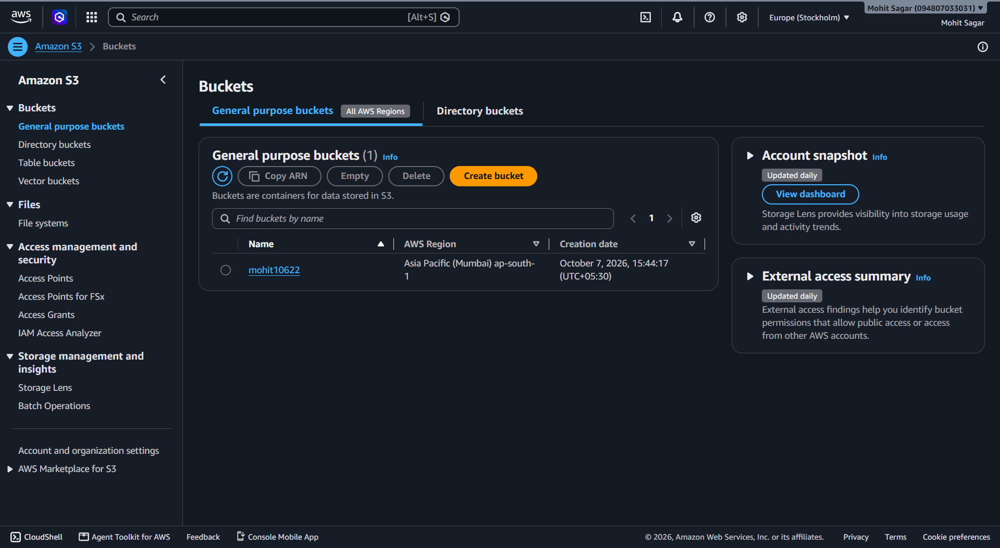
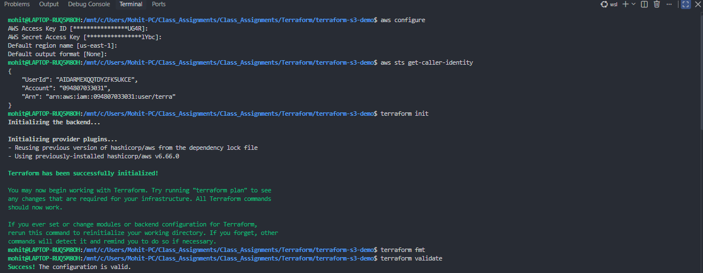
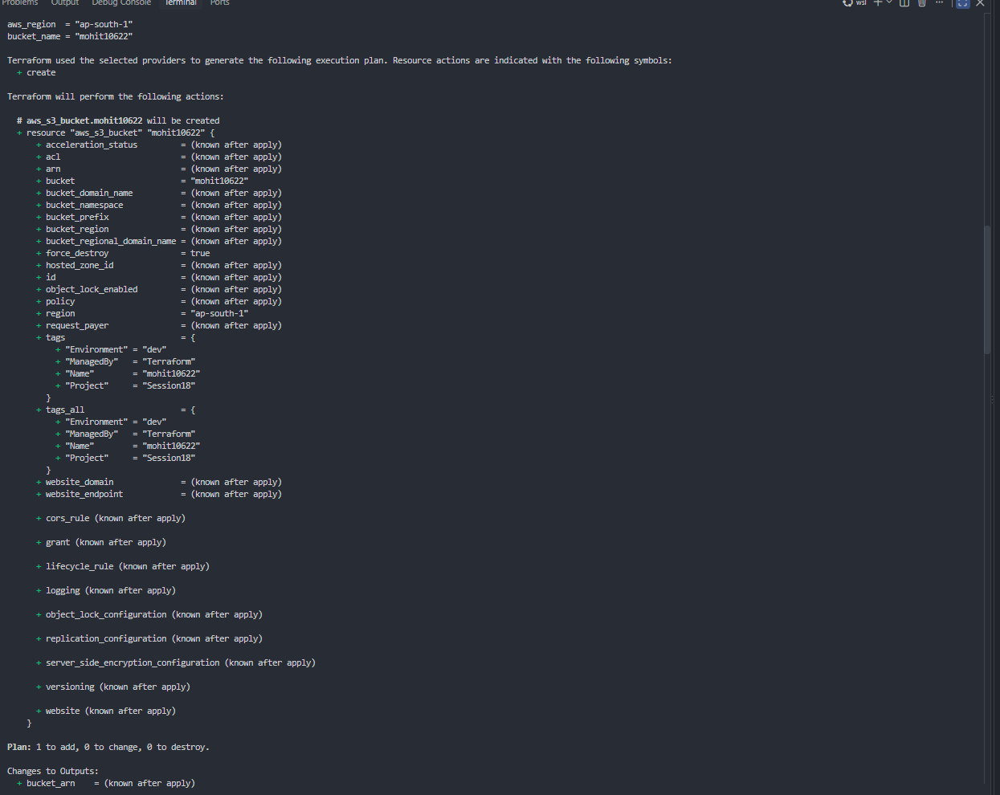
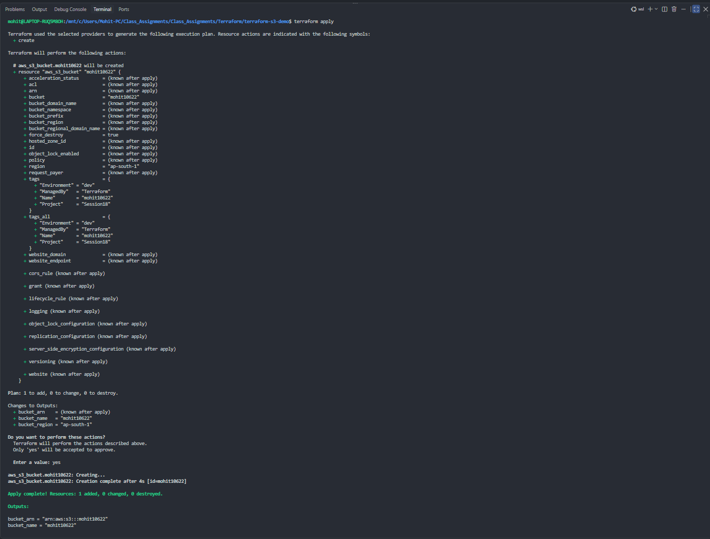
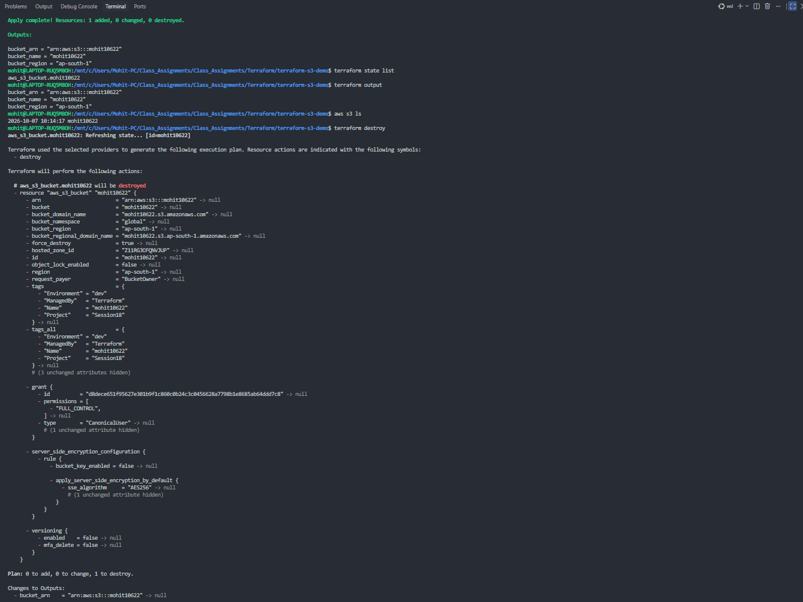

## Terraform S3 Bucket Results

### 1. Verify the S3 bucket in AWS

The AWS S3 console confirms that the `mohit10622` bucket was created in the Mumbai region (`ap-south-1`).

### 2. Initialize and validate Terraform

AWS credentials were verified with `aws sts get-caller-identity`, then Terraform was initialized, formatted, and validated successfully.

### 3. Review the execution plan

`terraform plan` shows one S3 bucket to be created, with the bucket name, region, tags, and output values all set to `mohit10622`.

### 4. Create the bucket with Terraform

`terraform apply` completed successfully: one resource was added and Terraform displayed the generated bucket ARN, name, and region.

### 5. Inspect state, outputs, and cleanup plan

Terraform state and output commands confirm the managed bucket. The final command prepares a destroy plan, showing the resource that would be removed during cleanup.

## AWS Services Notes

The `aws-services` exercises introduce the main AWS building blocks used alongside Terraform:

- **IAM** controls identities, permissions, roles, and access policies.
- **EC2** provides configurable virtual machines for compute workloads.
- **S3** stores files as objects inside globally unique buckets; this assignment uses the `mohit10622` bucket example.
- **VPC** provides isolated networking with subnets, route tables, security controls, and internet access design.
- **DynamoDB** is a serverless NoSQL database for key-based access, while **RDS** is a managed relational SQL database.

Terraform makes these resources repeatable: define infrastructure in `.tf` files, review it with `terraform plan`, and create it with `terraform apply`.
