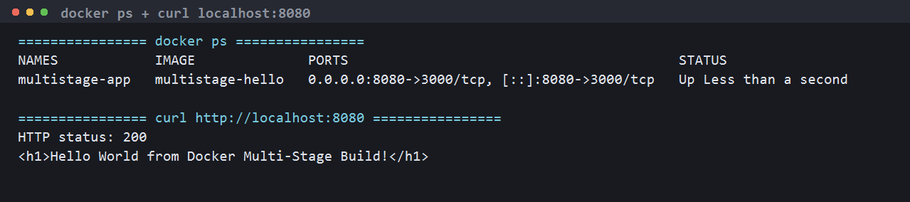
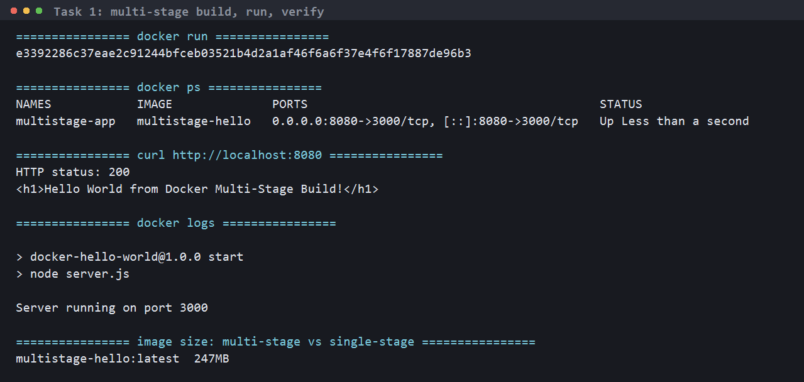
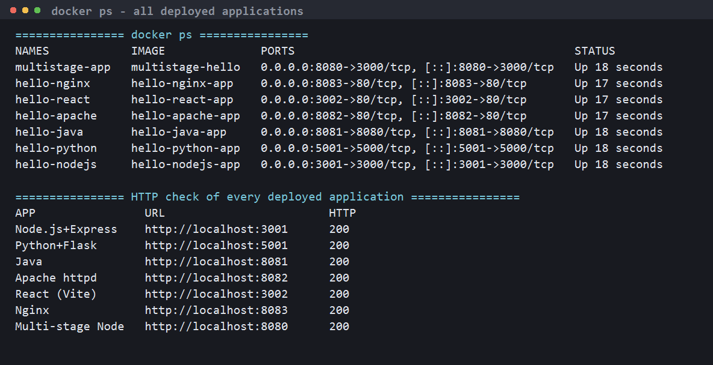
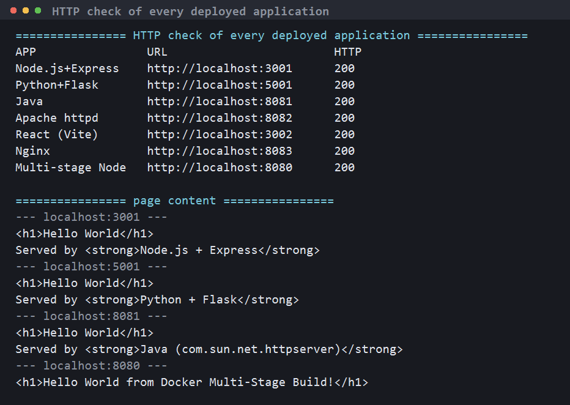

# Docker Multi-Stage Build Assignment

**Name:** Mohit Sagar
**Enrollment Number:** 2024bcs10622

---

## Task 1 - Run the Multi-Stage Dockerfile

### 1. Clone the repository

```bash
git clone https://github.com/MohitSAGAR11/devops-heros.git
cd devops-heros/session6-7-docker/multi-stage-dockerfile
```

The multi-stage Dockerfile in that folder:

```dockerfile
# -------------------------
# Stage 1: Build
# -------------------------
FROM node:24-alpine AS builder
WORKDIR /app
COPY package*.json ./
RUN npm install
COPY . .

# -------------------------
# Stage 2: Production
# -------------------------
FROM node:24-alpine AS production
WORKDIR /app
COPY --from=builder /app/package*.json ./
RUN npm install --omit=dev
COPY --from=builder /app/server.js ./
EXPOSE 3000
CMD ["npm", "start"]
```

The app it serves (`server.js`) listens on port **3000** inside the container:

```js
app.get("/", (req, res) => {
  res.send("<h1>Hello World from Docker Multi-Stage Build!</h1>");
});
```

### 2. Build the image

```bash
docker build -t multistage-hello .
```

```
Step 10/12 : COPY --from=builder /app/server.js ./
 ---> b771433d41dd
Step 11/12 : EXPOSE 3000
 ---> 5200a0ae10d8
Step 12/12 : CMD ["npm", "start"]
 ---> a27e1d8b7753
Successfully built a27e1d8b7753
Successfully tagged multistage-hello:latest
```

### 3. Run the container on port 8080

The application listens on 3000 inside the container, so it is published to
host port **8080** with `-p 8080:3000`:

```bash
docker run -d --name multistage-app -p 8080:3000 multistage-hello
```

### 4. Access the application and verify the output

```bash
curl http://localhost:8080
```

```
HTTP status: 200
<h1>Hello World from Docker Multi-Stage Build!</h1>
```

Verified: the application displays **Hello World from Docker Multi-Stage
Build!** — also viewable in a browser at <http://localhost:8080>.

### 5. Verify the running container with `docker ps`

```bash
docker ps
```

```
NAMES            IMAGE              PORTS                                         STATUS
multistage-app   multistage-hello   0.0.0.0:8080->3000/tcp, [::]:8080->3000/tcp   Up Less than a second
```

Confirmed: the application is reachable on **port 8080**
(`0.0.0.0:8080->3000/tcp`).

### 6. Container logs

```bash
docker logs multistage-app
```

```
> docker-hello-world@1.0.0 start
> node server.js

Server running on port 3000
```

---

## Task 2 - Documentation

**Name:** Mohit Sagar
**Enrollment Number:** 2024bcs10622

### Screenshot: application running + `docker ps` on port 8080



### Screenshot: full Task 1 run



Raw output: [`task1_output.log`](task1_output.log)

---

## Task 3 - Docker Application Deployment

Seven applications of six different types were built and deployed as
containers. The application code and Dockerfiles are in
[`../docker-assignment/`](../docker-assignment/).

| # | Type | Image | Host port | URL | HTTP |
|---|---|---|---|---|---|
| 1 | **Node.js** + Express | `hello-nodejs-app` | 3001 | http://localhost:3001 | 200 |
| 2 | **Python** + Flask | `hello-python-app` | 5001 | http://localhost:5001 | 200 |
| 3 | **Java** (JDK HTTP server) | `hello-java-app` | 8081 | http://localhost:8081 | 200 |
| 4 | **Apache** httpd | `hello-apache-app` | 8082 | http://localhost:8082 | 200 |
| 5 | **React** (Vite) | `hello-react-app` | 3002 | http://localhost:3002 | 200 |
| 6 | **Nginx** | `hello-nginx-app` | 8083 | http://localhost:8083 | 200 |
| 7 | **Node.js multi-stage** (Task 1) | `multistage-hello` | 8080 | http://localhost:8080 | 200 |

### `docker ps` - all containers running

```
NAMES            IMAGE              PORTS                                         STATUS
multistage-app   multistage-hello   0.0.0.0:8080->3000/tcp, [::]:8080->3000/tcp   Up 18 seconds
hello-nginx      hello-nginx-app    0.0.0.0:8083->80/tcp, [::]:8083->80/tcp       Up 17 seconds
hello-react      hello-react-app    0.0.0.0:3002->80/tcp, [::]:3002->80/tcp       Up 17 seconds
hello-apache     hello-apache-app   0.0.0.0:8082->80/tcp, [::]:8082->80/tcp       Up 17 seconds
hello-java       hello-java-app     0.0.0.0:8081->8080/tcp, [::]:8081->8080/tcp   Up 18 seconds
hello-python     hello-python-app   0.0.0.0:5001->5000/tcp, [::]:5001->5000/tcp   Up 18 seconds
hello-nodejs     hello-nodejs-app   0.0.0.0:3001->3000/tcp, [::]:3001->3000/tcp   Up 18 seconds
```



### HTTP check of every application

```
APP                URL                        HTTP
Node.js+Express    http://localhost:3001      200
Python+Flask       http://localhost:5001      200
Java               http://localhost:8081      200
Apache httpd       http://localhost:8082      200
React (Vite)       http://localhost:3002      200
Nginx              http://localhost:8083      200
Multi-stage Node   http://localhost:8080      200
```

### Page content of the three required types

```
--- localhost:3001 ---
<h1>Hello World</h1>
Served by <strong>Node.js + Express</strong>
--- localhost:5001 ---
<h1>Hello World</h1>
Served by <strong>Python + Flask</strong>
--- localhost:8081 ---
<h1>Hello World</h1>
Served by <strong>Java (com.sun.net.httpserver)</strong>
--- localhost:8080 ---
<h1>Hello World from Docker Multi-Stage Build!</h1>
```



Raw output: [`task3_output.log`](task3_output.log)

---

## Extra: how much does multi-stage actually save here?

I built the *same* app with a single-stage Dockerfile
([`single-stage-comparison/`](single-stage-comparison/)) to measure the
difference:

```
REPOSITORY          TAG       SIZE
singlestage-hello   latest    253MB
multistage-hello    latest    247MB
```

Only **6 MB**, because this app's single dependency is Express and it has no
dev dependencies or build step — there is barely anything for the build stage
to throw away.

Multi-stage pays off when the build stage produces artifacts much smaller than
the toolchain that made them. Two measured examples from
[`../docker-assignment/`](../docker-assignment/):

- **React app: 73.8 MB.** Stage 1 (`node:20-alpine` + `node_modules` + Vite)
  builds `dist`; stage 2 copies only `dist` into `nginx:alpine`. Node and
  `node_modules` never reach the final image.
- **Java app: 286 MB.** Stage 1 compiles with the JDK, stage 2 ships only
  `HelloWorld.class` on a JRE image — no compiler in production.

## What I understood

- `FROM ... AS <name>` names a stage; `COPY --from=<name>` pulls files out of
  it. Everything else in that stage is discarded.
- Only the **last** `FROM` becomes the final image, so build tools, source
  code and caches left in earlier stages cost nothing at runtime.
- Smaller final images mean faster pulls and a smaller attack surface — no
  compiler or package manager sitting in production.
- `EXPOSE 3000` is documentation only. `-p 8080:3000` (host:container) is what
  actually publishes the port, which is how this app runs on 8080 while
  listening on 3000 internally.
- One real thing I hit: this Dockerfile uses `CMD ["npm", "start"]`, so PID 1
  is npm rather than node. When the Docker daemon restarted, the container
  exited with code 1 and `npm error signal SIGTERM` instead of shutting down
  cleanly. `CMD ["node", "server.js"]` avoids that, because node then receives
  the signal directly.

Built and run with Docker Engine 29.1.3 on Ubuntu (WSL2).
