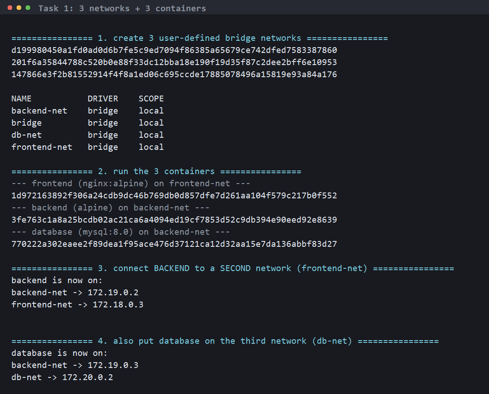
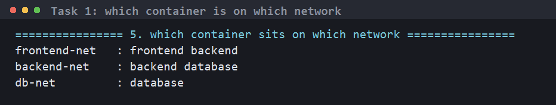
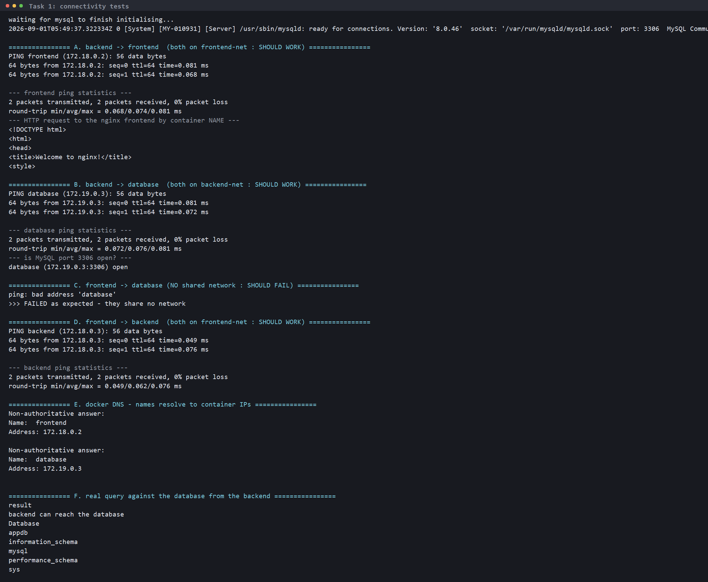
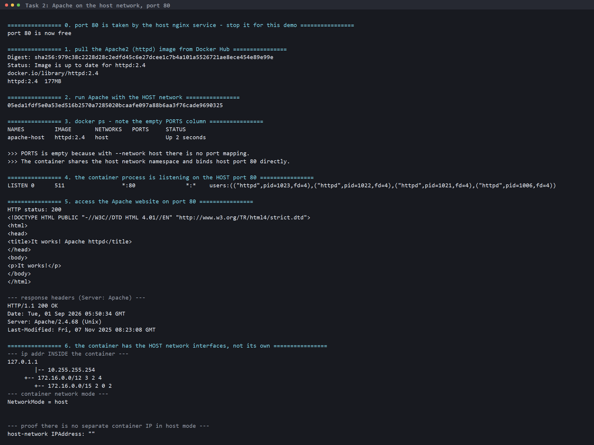
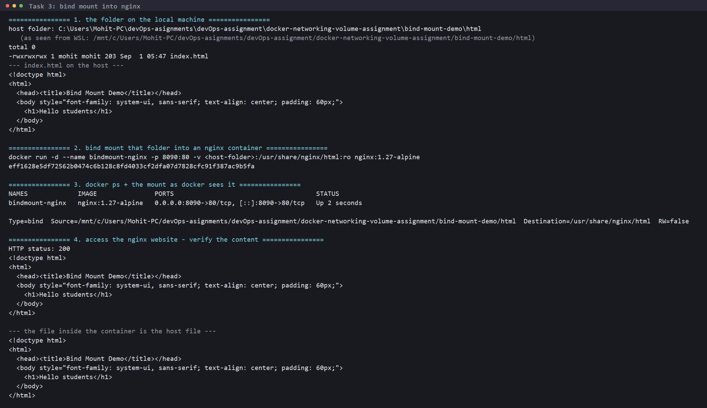
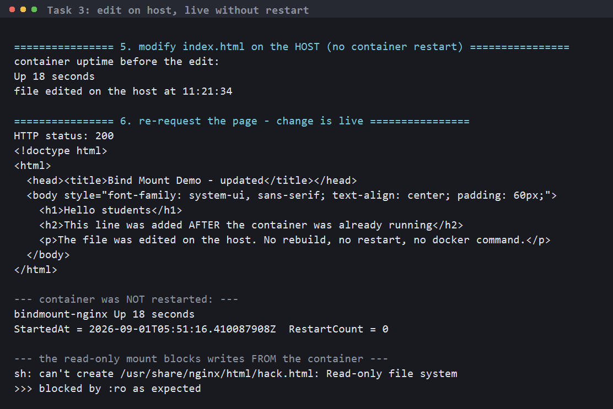
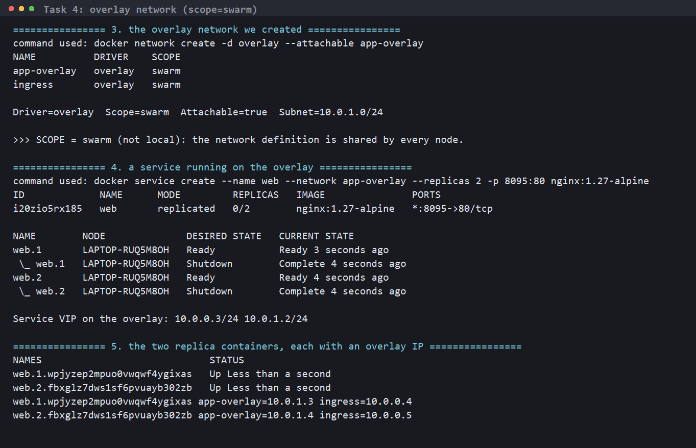
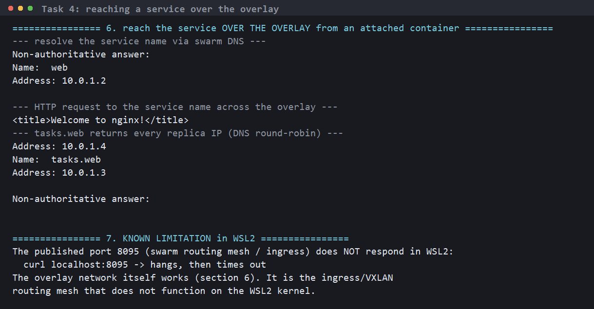

# Docker Networking & Volume Assignment

**Name:** Mohit Sagar
**Enrollment Number:** 2024bcs10622

All four tasks were run on Docker Engine 29.1.3 (Ubuntu / WSL2). Raw output of
every run is in the `*.log` files; the screenshots below are rendered from
those same runs.

| File | Contents |
|---|---|
| `task1_setup.log`, `task1_connectivity.log` | Task 1 |
| `task2_host_network.log` | Task 2 |
| `task3_bind_mount.log`, `task3_live_reload.log` | Task 3 |
| `task4_overlay.log` | Task 4 |
| `bind-mount-demo/html/index.html` | the bind-mounted file |

---

## Task 1 - Docker Container Networking

### Design

| Network | Containers on it |
|---|---|
| `frontend-net` | `frontend`, **`backend`** |
| `backend-net` | **`backend`**, `database` |
| `db-net` | `database` |

`backend` sits on **two** networks, which makes it the only path between the
frontend and the database. `frontend` and `database` share no network, so they
cannot reach each other — that isolation is the point of the design.

### Commands

```bash
# 3 user-defined bridge networks
docker network create frontend-net
docker network create backend-net
docker network create db-net

# 3 containers
docker run -d --name frontend --network frontend-net nginx:1.27-alpine
docker run -d --name backend  --network backend-net  alpine:3.20 sleep infinity
docker run -d --name database --network backend-net \
  -e MYSQL_ROOT_PASSWORD=rootpass -e MYSQL_DATABASE=appdb mysql:8.0

# put the backend on a SECOND network
docker network connect frontend-net backend
docker network connect db-net database
```



### Each container's addresses

```
backend is now on:
backend-net  -> 172.19.0.2
frontend-net -> 172.18.0.3

database is now on:
backend-net -> 172.19.0.3
db-net      -> 172.20.0.2
```

The backend has **one IP per network** — that is what being on two networks
actually means.

```
frontend-net   : frontend backend
backend-net    : backend database
db-net         : database
```



### Connectivity checks

```bash
docker exec backend  ping -c 2 frontend
docker exec backend  wget -qO- http://frontend
docker exec backend  ping -c 2 database
docker exec backend  nc -zv database 3306
docker exec frontend ping -c 2 -W 2 database     # expected to fail
docker exec frontend ping -c 2 backend
```

| From | To | Shared network | Result |
|---|---|---|---|
| backend | frontend | `frontend-net` | **works** — 0% packet loss, HTTP 200 from nginx |
| backend | database | `backend-net` | **works** — `database (172.19.0.3:3306) open` |
| frontend | backend | `frontend-net` | **works** — 0% packet loss |
| frontend | database | *none* | **fails** — `ping: bad address 'database'` |

```
================ A. backend -> frontend ================
PING frontend (172.18.0.2): 56 data bytes
64 bytes from 172.18.0.2: seq=0 ttl=64 time=0.081 ms
2 packets transmitted, 2 packets received, 0% packet loss

================ B. backend -> database ================
64 bytes from 172.19.0.3: seq=0 ttl=64 time=0.081 ms
--- is MySQL port 3306 open? ---
database (172.19.0.3:3306) open

================ C. frontend -> database (SHOULD FAIL) ================
ping: bad address 'database'
>>> FAILED as expected - they share no network
```

A real query proves the database is genuinely usable:

```
mysql> SELECT "backend can reach the database";
result
backend can reach the database

Database
appdb
information_schema
mysql
performance_schema
sys
```



### What I understood

- On a **user-defined** network Docker runs an embedded DNS server at
  `127.0.0.11`, so containers reach each other by **name** (`ping database`).
  The default `bridge` network does *not* do this — there you would need IPs or
  the old `--link`.
- `docker network connect` attaches a **running** container to another network,
  no restart needed. Each attachment gives it another IP.
- Containers on different networks are isolated at layer 2/3 — the name does
  not even resolve. This is how you keep a database off the public-facing
  network, exactly the three-tier pattern here.

---

## Task 2 - Host Network

### Commands

```bash
docker pull httpd:2.4
docker run -d --name apache-host --network host httpd:2.4
curl http://localhost:80
```

> **Note:** this WSL machine already runs an nginx *service* on port 80, so I
> stopped it (`systemctl stop nginx`) for the demo and started it again
> afterwards. Two processes cannot bind the same host port.

### Output

```
================ 3. docker ps - note the empty PORTS column ================
NAMES         IMAGE       NETWORKS   PORTS     STATUS
apache-host   httpd:2.4   host                 Up 2 seconds

>>> PORTS is empty because with --network host there is no port mapping.

================ 4. the container process is listening on the HOST port 80 ================
LISTEN 0  511  *:80  *:*  users:(("httpd",pid=1023,fd=4),("httpd",pid=1022,fd=4),...)

================ 5. access the Apache website on port 80 ================
HTTP status: 200
<html><head>
<title>It works! Apache httpd</title>
</head><body>
<p>It works!</p>
</body></html>

--- response headers ---
HTTP/1.1 200 OK
Server: Apache/2.4.68 (Unix)
```

Also verified from the Windows browser side: `http://localhost:80` → **200**.

```
NetworkMode = host
host-network IPAddress: ""      <- no separate container IP
```



### What I understood

- `--network host` removes network isolation: the container shares the host's
  **network namespace**. No NAT, no veth pair, no bridge.
- Because of that, `-p` is meaningless (and ignored), `docker ps` shows an
  empty PORTS column, and the container has **no IP of its own** — the `httpd`
  process is listening on the host's `*:80` directly, visible in the host's own
  `ss -tlnp`.
- Trade-offs: slightly faster (no NAT hop) and useful for tools that need to
  see host interfaces, but you lose isolation and you can only run one process
  per host port. Bridge + `-p` is the normal choice.
- Caveat: `--network host` only behaves this way on Linux. On Docker Desktop
  for Windows/Mac "host" means the Linux VM's network, not Windows itself.

---

## Task 3 - Bind Mount

### 1. Folder and file on the local machine

`bind-mount-demo/html/index.html`:

```html
<h1>Hello students</h1>
```

### 2. Bind mount it into nginx

```bash
docker run -d --name bindmount-nginx -p 8090:80 \
  -v /mnt/c/Users/Mohit-PC/devOps-asignments/devOps-assignment/docker-networking-volume-assignment/bind-mount-demo/html:/usr/share/nginx/html:ro \
  nginx:1.27-alpine
```

```
Type=bind
Source=/mnt/c/.../bind-mount-demo/html
Destination=/usr/share/nginx/html
RW=false
```

### 3. Access the website - content verified

```bash
curl http://localhost:8090
```

```
HTTP status: 200
<h1>Hello students</h1>
```



### 4. Modify the file, verify the change is live

The file was edited **on the host** while the container kept running:

```
HTTP status: 200
<h1>Hello students</h1>
<h2>This line was added AFTER the container was already running</h2>
<p>The file was edited on the host. No rebuild, no restart, no docker command.</p>

--- container was NOT restarted: ---
bindmount-nginx Up 18 seconds
StartedAt = 2026-09-01T05:51:16.410087908Z  RestartCount = 0
```

`RestartCount = 0` and the unchanged `StartedAt` prove no restart happened.

The `:ro` flag also works as intended — the container cannot write back:

```
sh: can't create /usr/share/nginx/html/hack.html: Read-only file system
>>> blocked by :ro as expected
```



### What I understood

- A **bind mount** maps a host path straight into the container. There is one
  copy of the file; the container just sees it at a different path — which is
  why an edit on the host is visible immediately, with no restart, no rebuild
  and no `docker cp`.
- That makes it the standard local-development setup: edit code on the host,
  the running container picks it up.
- **Bind mount vs volume:**
  - *Bind mount* — you choose the host path, contents depend on the host's
    directory layout, great for development, not portable.
  - *Volume* (`docker volume create`) — Docker manages the storage under
    `/var/lib/docker/volumes`, portable, backup-able, the right choice for
    production data such as a database.
- `:ro` should be the default for anything the container only needs to read —
  it stops a compromised container from modifying host files.
- Note for production: a bind mount **hides** whatever was already at the
  destination inside the image.

---

## Task 4 - Overlay Network

### What an overlay network is

A bridge network only exists on one Docker host. An **overlay** network spans
**multiple Docker hosts**, so containers on different physical machines get
addresses on the same virtual layer-2 network and can talk to each other by
name as if they were on one switch.

It is built on **VXLAN**: each packet between containers is wrapped inside a
UDP packet (port **4789**), sent across the real network to the other host, and
unwrapped there. The physical network only sees ordinary UDP; the containers
see a flat private subnet.

### Requirements

- **Swarm mode** (`docker swarm init` / `docker swarm join`), or an external
  key-value store on old standalone setups. Overlay needs a control plane to
  distribute the network state to every node.
- Ports open between the hosts: **2377/tcp** (cluster management),
  **7946/tcp+udp** (node discovery/gossip), **4789/udp** (VXLAN data).

### Live demo (single node)

```bash
docker swarm init --advertise-addr 172.30.207.24
docker network create -d overlay --attachable app-overlay
docker service create --name web --network app-overlay --replicas 2 \
  -p 8095:80 nginx:1.27-alpine
```

```
NAME          DRIVER    SCOPE
app-overlay   overlay   swarm
ingress       overlay   swarm

Driver=overlay  Scope=swarm  Attachable=true  Subnet=10.0.1.0/24
```

`SCOPE = swarm` (not `local`) is the key difference from a bridge network — the
definition is shared cluster-wide, not tied to one daemon. Swarm also creates
`ingress` (overlay) and `docker_gwbridge` automatically.



Service and replicas, each with an overlay IP:

```
ID             NAME   MODE         REPLICAS   IMAGE               PORTS
i20zio5rx185   web    replicated   2/2        nginx:1.27-alpine   *:8095->80/tcp

web.1.wpjyzep2mpuo...   app-overlay=10.0.1.3  ingress=10.0.0.4
web.2.fbxglz7dws1s...   app-overlay=10.0.1.4  ingress=10.0.0.5

Service VIP on the overlay: 10.0.0.3/24 10.0.1.2/24
```

Reaching the service **over the overlay** from an attached container:

```
--- resolve the service name via swarm DNS ---
Name:	web
Address: 10.0.1.2                <- the service VIP, not a container IP

--- HTTP request to the service name across the overlay ---
<title>Welcome to nginx!</title>

--- tasks.web returns every replica IP (DNS round-robin) ---
Name:	tasks.web
Address: 10.0.1.4
Address: 10.0.1.3
```



**Honest note:** the published port `8095` (the swarm **routing mesh** /
ingress) does **not** respond on WSL2 — `curl localhost:8095` hangs and times
out. The overlay network itself works fine, as the section above shows; it is
the ingress VXLAN path that the WSL2 kernel does not handle. On a normal Linux
host this would return the nginx page.

Cleaned up afterwards with `docker service rm web`,
`docker network rm app-overlay` and `docker swarm leave --force`, so the daemon
is back to its original non-swarm state.

### How it works across multiple hosts

1. `docker swarm init` on host A; `docker swarm join` on hosts B and C.
2. `docker network create -d overlay app-net` on the manager. The definition is
   distributed to every node through the swarm control plane (gossip over
   7946).
3. A container on host A gets `10.0.1.3`, one on host B gets `10.0.1.4` — the
   **same subnet** despite being on different machines.
4. A packet from A to B is encapsulated in VXLAN, sent over the real network as
   UDP/4789 between the hosts' physical IPs, and decapsulated on B.
5. Swarm's DNS resolves the **service name** to a **VIP**; traffic to the VIP is
   load-balanced across the replicas wherever they run. `tasks.<service>`
   returns the individual replica IPs instead.

### Use cases

- **Multi-host clusters** — a service on one machine talking to a database or
  API on another without hard-coding host IPs or publishing ports publicly.
- **Scaling** — replicas can be scheduled on any node and still reach each
  other on one flat network.
- **Service discovery + load balancing** — reach a service by name and let the
  VIP spread the load.
- **Isolation between stacks** — separate overlay networks per application,
  cluster-wide.
- **Encryption in transit** — `--opt encrypted` turns on IPsec between nodes.

### Overlay vs the other drivers

| Driver | Scope | Use for |
|---|---|---|
| `bridge` | single host | the normal default; containers on one machine (Task 1) |
| `host` | single host | no isolation, container binds host ports directly (Task 2) |
| `overlay` | **multi-host** | swarm services spanning several machines (Task 4) |
| `macvlan` | single host | container gets a real MAC/IP on the physical LAN |
| `none` | single host | no networking at all |

---

## Current state / how to re-run

Containers left running so the results can be checked:

| Container | Port | URL |
|---|---|---|
| `bindmount-nginx` | 8090 | http://localhost:8090 |
| `frontend`, `backend`, `database` | internal only | `docker exec backend ping frontend` |

The Apache host-network container was removed and the host nginx service
restarted, because both want port 80. To re-run Task 2:

```bash
sudo systemctl stop nginx
docker run -d --name apache-host --network host httpd:2.4
curl http://localhost:80
docker rm -f apache-host && sudo systemctl start nginx
```

Full cleanup:

```bash
docker rm -f frontend backend database bindmount-nginx
docker network rm frontend-net backend-net db-net
```
