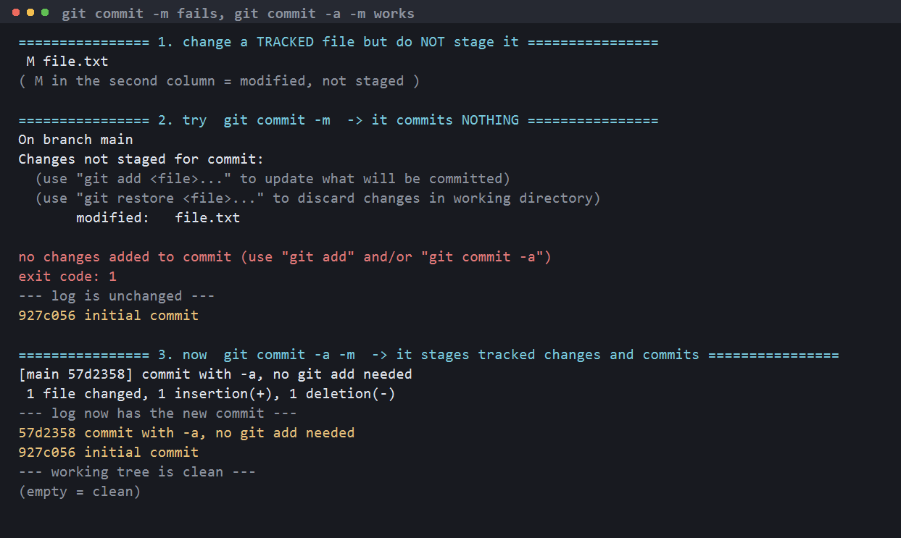
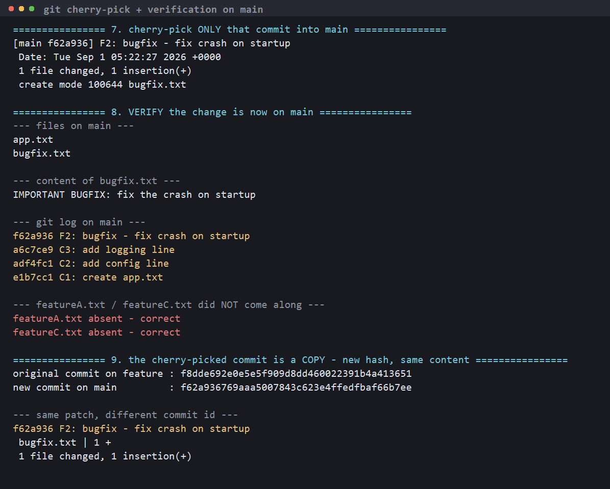
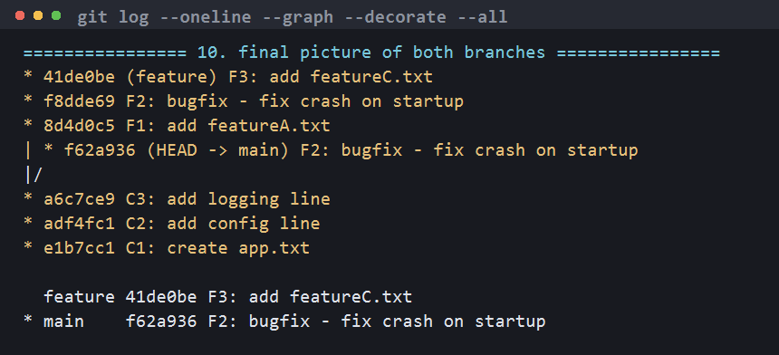

# Git Assignment

| File | What it is |
|---|---|
| `task1_commit_a_vs_m.sh` | Script for Task 1 (`git commit -m` vs `git commit -a -m`) |
| `task2_cherry_pick.sh` | Script for Task 2 (cherry-pick one commit from a branch into main) |
| `task1_output.log`, `task2_output.log` | Raw output of the runs |
| `screenshots/` | Screenshots of the terminal output |

Both scripts build a throwaway repo under `/tmp`, so they can be re-run safely:

```bash
bash task1_commit_a_vs_m.sh
bash task2_cherry_pick.sh
```

---

# Task 1 - `git commit -m` vs `git commit -a -m`

## The difference in one line

| Command | What it does |
|---|---|
| `git commit -m "msg"` | Commits **only what is already staged** (`git add`ed). |
| `git commit -a -m "msg"` | Automatically stages **every modified or deleted _tracked_ file**, then commits. |

`-a` is a shortcut for `git add` on tracked files — it is **not** `git add .`
and it will **never** pick up a brand-new untracked file.



## Test 1 - modify a tracked file, do not stage it, then `git commit -m`

```bash
echo "version 2" > file.txt
git status --short
git commit -m "try to commit without staging"
```

```
 M file.txt
( M in the second column = modified, not staged )

On branch main
Changes not staged for commit:
  (use "git add <file>..." to update what will be committed)
  (use "git restore <file>..." to discard changes in working directory)
	modified:   file.txt

no changes added to commit (use "git add" and/or "git commit -a")
exit code: 1
--- log is unchanged ---
927c056 initial commit
```

**Observation:** nothing was committed. Git even tells you the two ways out:
`git add` or `git commit -a`. The commit exit code was `1` (failure) and the
log still has only the initial commit.

## Test 2 - the same change with `git commit -a -m`

```bash
git commit -a -m "commit with -a, no git add needed"
git log --oneline
git status --short
```

```
[main 57d2358] commit with -a, no git add needed
 1 file changed, 1 insertion(+), 1 deletion(-)
--- log now has the new commit ---
57d2358 commit with -a, no git add needed
927c056 initial commit
--- working tree is clean ---
(empty = clean)
```

**Observation:** the same change went in with one command, no `git add`.

## Test 3 - the long way, for comparison

```bash
echo "version 3" > file.txt
git add file.txt
git status --short          # M in the FIRST column = staged
git commit -m "commit with git add + -m"
```

```
M  file.txt
( M in the FIRST column = staged )
[main 14cd58a] commit with git add + -m
 1 file changed, 1 insertion(+), 1 deletion(-)
```

**Observation:** `git add` + `git commit -m` and `git commit -a -m` produce the
same result here. The difference is only *who* does the staging. Note where the
`M` sits in `git status --short`: first column = staged, second column = not
staged.

## Test 4 - the important limit: `-a` ignores untracked files

```bash
echo "brand new file" > newfile.txt
git status --short                 # ?? = untracked
git commit -a -m "try to commit an untracked file with -a"
```

```
?? newfile.txt
( ?? = untracked )
On branch main
Untracked files:
  (use "git add <file>..." to include in what will be committed)
	newfile.txt

nothing added to commit but untracked files present (use "git add" to track)
--- newfile.txt is still untracked ---
?? newfile.txt
```

**Observation:** `-a` did nothing, because git has never seen `newfile.txt`
before. A new file always needs `git add` once:

```bash
git add newfile.txt
git commit -m "add newfile.txt after git add"
```

## What I understood

- `-a` = "stage all **tracked** changes for me", so it saves a `git add` on
  files git already knows about.
- It skips untracked files, so `git commit -a -m` alone can silently leave a
  new file out of the commit — the mistake to watch for.
- It also stages **deletions** of tracked files, which `git add <file>` on a
  deleted path would need `git rm` for.
- Because `-a` stages everything modified, it is easy to sweep in unrelated
  edits. When I want a clean, focused commit I stage deliberately with
  `git add -p` / `git add <file>` and use plain `git commit -m`.

**Full Task 1 terminal output:** [`screenshots/task1-full.png`](screenshots/task1-full.png)

---

# Task 2 - `git cherry-pick`

**Goal:** take *one specific commit* from a branch and apply it to `main`,
without bringing the rest of that branch along.

## Step 1 - three commits on `main`

```bash
git init -b main
echo "line 1 - project start" > app.txt ; git add app.txt ; git commit -m "C1: create app.txt"
echo "line 2 - add config"   >> app.txt ; git add app.txt ; git commit -m "C2: add config line"
echo "line 3 - add logging"  >> app.txt ; git add app.txt ; git commit -m "C3: add logging line"
```

## Step 2 - `git log` on main

```bash
git log --oneline
```

```
a6c7ce9 C3: add logging line
adf4fc1 C2: add config line
e1b7cc1 C1: create app.txt
```

## Step 3 - create a new branch

```bash
git checkout -b feature
git branch -v
```

```
Switched to a new branch 'feature'
* feature a6c7ce9 C3: add logging line
  main    a6c7ce9 C3: add logging line
```

## Step 4 - three commits on `feature`

```bash
echo "feature A" > featureA.txt                                    ; git add featureA.txt ; git commit -m "F1: add featureA.txt"
echo "IMPORTANT BUGFIX: fix the crash on startup" > bugfix.txt      ; git add bugfix.txt   ; git commit -m "F2: bugfix - fix crash on startup"
echo "feature C" > featureC.txt                                    ; git add featureC.txt ; git commit -m "F3: add featureC.txt"
```

## Step 5 - `git log` to identify the commit I want

```bash
git log --oneline
```

```
41de0be F3: add featureC.txt
f8dde69 F2: bugfix - fix crash on startup     <-- I want ONLY this one
8d4d0c5 F1: add featureA.txt
a6c7ce9 C3: add logging line
adf4fc1 C2: add config line
e1b7cc1 C1: create app.txt
```

The bugfix is urgent and has to ship on `main` now, but `F1` and `F3` are
unfinished feature work — so a merge would be wrong here. That is exactly the
case cherry-pick exists for.

## Step 6 - back to `main`, confirm the fix is not there

```bash
git checkout main
ls -1
git log --oneline
```

```
Switched to branch 'main'
app.txt
bugfix.txt present?
NO - as expected
a6c7ce9 C3: add logging line
adf4fc1 C2: add config line
e1b7cc1 C1: create app.txt
```

## Step 7 - cherry-pick that one commit

```bash
git cherry-pick f8dde69
```

```
[main f62a936] F2: bugfix - fix crash on startup
 Date: Tue Sep 1 05:22:27 2026 +0000
 1 file changed, 1 insertion(+)
 create mode 100644 bugfix.txt
```

## Step 8 - verify the change is on `main`

```bash
ls -1
cat bugfix.txt
git log --oneline
```

```
--- files on main ---
app.txt
bugfix.txt

--- content of bugfix.txt ---
IMPORTANT BUGFIX: fix the crash on startup

--- git log on main ---
f62a936 F2: bugfix - fix crash on startup
a6c7ce9 C3: add logging line
adf4fc1 C2: add config line
e1b7cc1 C1: create app.txt

--- featureA.txt / featureC.txt did NOT come along ---
featureA.txt absent - correct
featureC.txt absent - correct
```

**Verified:** `bugfix.txt` and its content are on `main`, the commit is in
`main`'s history, and `featureA.txt` / `featureC.txt` were left behind — only
the one selected commit came across.



## Step 9 - the cherry-picked commit is a *copy*

```
original commit on feature : f8dde692e0e5e5f909d8dd460022391b4a413651
new commit on main         : f62a936769aaa5007843c623e4ffedfbaf66b7ee
```

Same patch, same message, **different commit hash** — because the parent is
different, and the hash is computed from the content *plus* the parent.

## Step 10 - both branches

```bash
git log --oneline --graph --decorate --all
```

```
* 41de0be (feature) F3: add featureC.txt
* f8dde69 F2: bugfix - fix crash on startup
* 8d4d0c5 F1: add featureA.txt
| * f62a936 (HEAD -> main) F2: bugfix - fix crash on startup
|/
* a6c7ce9 C3: add logging line
* adf4fc1 C2: add config line
* e1b7cc1 C1: create app.txt
```



The graph shows the commit existing **twice** — once on `feature`, once on
`main`.

## What I understood

- `git cherry-pick <hash>` replays one commit's changes onto the current
  branch. You must be **on the branch you want to receive it**.
- It copies the commit; the new one has a different hash. So if `feature` is
  merged into `main` later, that patch appears twice in history (git usually
  handles it, but it can cause a conflict).
- Typical use: a hotfix made on a feature branch that has to go to `main` or a
  release branch immediately, without the rest of the branch.
- Useful variants:
  - `git cherry-pick A B C` — several commits
  - `git cherry-pick A..B` — a range (excluding A)
  - `git cherry-pick -n <hash>` — apply without committing, so you can edit
  - `git cherry-pick -x <hash>` — record "(cherry picked from commit …)" in the
    message, good practice on shared branches
- On conflict: fix the files, `git add` them, then `git cherry-pick --continue`
  (or `--abort` to back out entirely).

**Full Task 2 terminal output:** [`screenshots/task2-full.png`](screenshots/task2-full.png)
