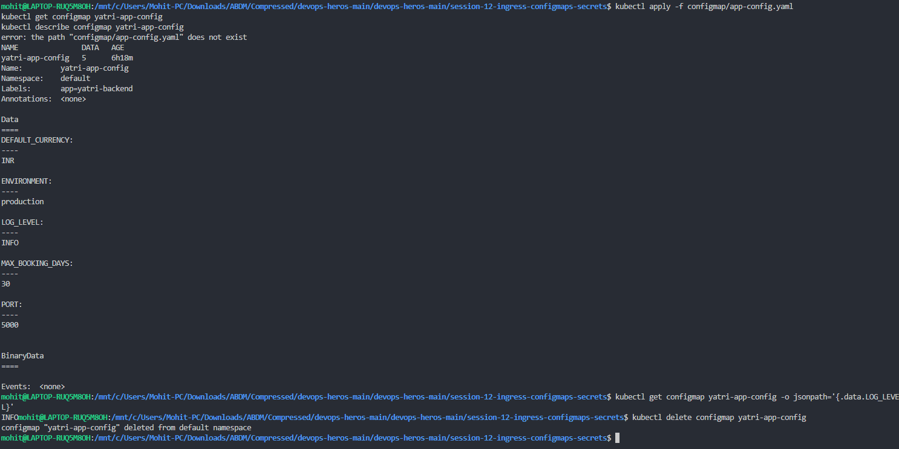
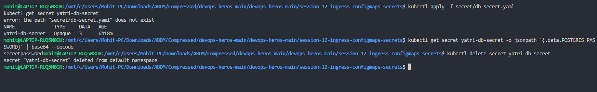
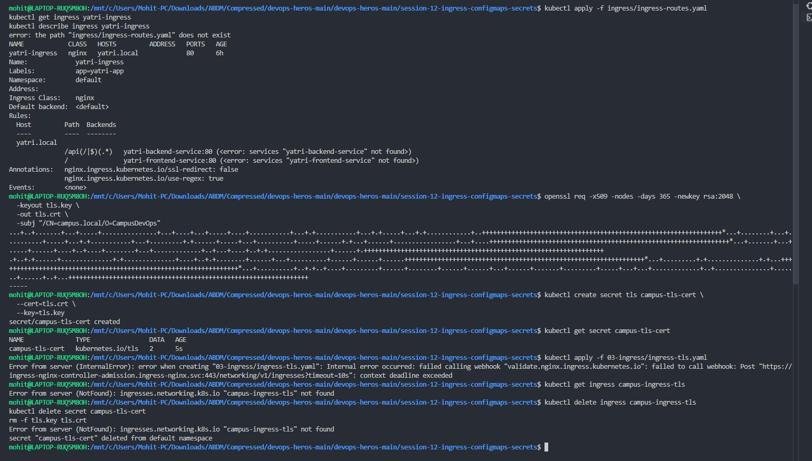

# Ingress, ConfigMaps & Secrets

> **Session 12 — Configuration and Layer-7 Routing**
> **Name:** Mohit Sagar &nbsp;•&nbsp; **Enrollment:** 2024bcs10622
> **Cluster:** minikube (Docker driver, WSL2) · `ingress-nginx` addon

---

## What each object is for

| Object | Holds | Stored as | Mount as |
|--------|-------|-----------|----------|
| **ConfigMap** | non-secret config — log level, ports, feature flags | plain text in etcd | env vars or a volume |
| **Secret** | passwords, tokens, TLS keys | **base64** in etcd (*encoding, not encryption*) | env vars or a volume |
| **Ingress** | host/path → Service routing rules, TLS termination | rules object | needs an **ingress controller** to do anything |

| # | Task | Screenshot |
|:-:|------|------------|
| 1 | [ConfigMap](#1--configmap) | `configmap.png` |
| 2 | [Secret](#2--secret) | `secrets.png` |
| 3 | [Ingress + TLS](#3--ingress--tls) | `ingress.png` |

---

## 1 · ConfigMap

**Goal —** store app configuration outside the image and read a single key back out.

```bash
kubectl apply -f 01-configmap/app-config.yaml
kubectl get configmap yatri-app-config
kubectl describe configmap yatri-app-config
kubectl get configmap yatri-app-config -o jsonpath='{.data.LOG_LEVEL}'
kubectl delete configmap yatri-app-config
```



### Result

```
NAME               DATA   AGE
yatri-app-config   5      6h18m
```

`describe` shows all five keys stored in **plain text** — no encoding anywhere:

| Key | Value |
|-----|-------|
| `DEFAULT_CURRENCY` | `INR` |
| `ENVIRONMENT` | `production` |
| `LOG_LEVEL` | `INFO` |
| `MAX_BOOKING_DAYS` | `30` |
| `PORT` | `5000` |

Reading one key back with JSONPath returns exactly `INFO`:

```bash
kubectl get configmap yatri-app-config -o jsonpath='{.data.LOG_LEVEL}'
# INFO
```

Note `BinaryData ====` is empty — binary payloads (certs, `.jks` files) would land there instead of `Data`.

### ⚠️ Error in this screenshot

<details open>
<summary><b><code>kubectl apply -f configmap/app-config.yaml</code> → <code>error: the path "configmap/app-config.yaml" does not exist</code></b></summary>

**Why it happened:** wrong relative path. The command ran from `session-12-ingress-configmaps-secrets/`, where the folder is numbered (`01-configmap/`, etc.), not bare `configmap/`.

**Why the rest of the output still worked:** the ConfigMap already existed in the cluster from an earlier run — note `AGE 6h18m`. So `get` and `describe` succeeded against an object the failed `apply` did not create. **Worth flagging:** had the object *not* already existed, everything below would have failed too. A stale object masking a failed apply is a genuinely dangerous illusion.

**What should have been there:**

```
configmap/yatri-app-config configured
```

**Fix — find the real path first:**

```bash
ls                                        # see the actual folder names
kubectl apply -f 01-configmap/app-config.yaml
# or, path-proof:
find . -name 'app-config.yaml'
kubectl apply -f "$(find . -name app-config.yaml | head -1)"
```

**Habit worth forming:** check the exit code before trusting the next command —

```bash
kubectl apply -f 01-configmap/app-config.yaml && kubectl describe configmap yatri-app-config
```

With `&&`, the describe never runs on a failed apply, so a stale object can't fool you.
</details>

### Using it in a Pod

The ConfigMap alone does nothing — something has to consume it:

```yaml
# as individual env vars
env:
  - name: LOG_LEVEL
    valueFrom:
      configMapKeyRef:
        name: yatri-app-config
        key: LOG_LEVEL

# or import every key at once
envFrom:
  - configMapRef:
      name: yatri-app-config
```

> Env vars are injected **once at container start** — editing the ConfigMap does not update a running pod. A ConfigMap mounted as a **volume** *does* refresh (within ~60 s), which is why config files beat env vars when you need hot reload.

---

## 2 · Secret

**Goal —** store credentials, then prove that base64 is encoding, not security.

```bash
kubectl apply -f 02-secret/db-secret.yaml
kubectl get secret yatri-db-secret
kubectl get secret yatri-db-secret -o jsonpath='{.data.POSTGRES_PASSWORD}' | base64 --decode
kubectl delete secret yatri-db-secret
```



### Result

```
NAME              TYPE     DATA   AGE
yatri-db-secret   Opaque   3      6h18m
```

| Field | Value | Meaning |
|-------|-------|---------|
| `TYPE` | `Opaque` | generic key/value — the default. Other types: `kubernetes.io/tls`, `kubernetes.io/dockerconfigjson`, `kubernetes.io/service-account-token` |
| `DATA` | `3` | three keys held |

Decoding one key:

```bash
kubectl get secret yatri-db-secret -o jsonpath='{.data.POSTGRES_PASSWORD}' | base64 --decode
# secretpassword
```

### 🔐 The lesson this command actually teaches

**Anyone with `get secret` permission can read every password in plain text with one pipe.** Base64 is *encoding*, not encryption — it exists so binary data survives YAML, nothing more. `kubectl describe secret` hides values, but `-o jsonpath` and `-o yaml` hand them right over.

Real protection needs:

| Layer | What it does |
|-------|--------------|
| **RBAC** | restrict who holds `get`/`list` on `secrets` — the single most effective control |
| **Encryption at rest** | `EncryptionConfiguration` on the API server, so etcd holds ciphertext |
| **External store** | HashiCorp Vault, AWS Secrets Manager, Sealed Secrets — keep the real value out of the cluster entirely |
| **Never commit** | a Secret manifest in git is a plaintext password in git history, forever |

### ⚠️ Error in this screenshot

<details open>
<summary><b><code>kubectl apply -f secret/db-secret.yaml</code> → <code>error: the path "secret/db-secret.yaml" does not exist</code></b></summary>

**Why it happened:** the same wrong-path mistake as Task 1 — the folder is `02-secret/`, not `secret/`.

**Same illusion, same danger:** `AGE 6h18m` shows the Secret survived from a previous session, so every command after the failed apply worked anyway.

**What should have been there:**

```
secret/yatri-db-secret configured
```

**Fix:**

```bash
kubectl apply -f 02-secret/db-secret.yaml
```

For credentials you'd rather not write into a YAML file at all, create the Secret imperatively:

```bash
kubectl create secret generic yatri-db-secret \
  --from-literal=POSTGRES_PASSWORD='secretpassword' \
  --from-literal=POSTGRES_USER='yatri' \
  --dry-run=client -o yaml | kubectl apply -f -
```

(`--dry-run=client -o yaml | kubectl apply -f -` makes it idempotent — re-running it updates instead of erroring with `AlreadyExists`.)
</details>

---

## 3 · Ingress + TLS

**Goal —** route `yatri.local/` and `yatri.local/api` to two Services through one nginx ingress controller, then add a TLS certificate.

```bash
# HTTP routing
kubectl apply -f 03-ingress/ingress-routes.yaml
kubectl get ingress yatri-ingress
kubectl describe ingress yatri-ingress

# self-signed TLS cert
openssl req -x509 -nodes -days 365 -newkey rsa:2048 \
  -keyout tls.key \
  -out tls.crt \
  -subj "/CN=campus.local/O=CampusDevOps"

kubectl create secret tls campus-tls-cert --cert=tls.crt --key=tls.key
kubectl get secret campus-tls-cert

kubectl apply -f 03-ingress/ingress-tls.yaml
kubectl get ingress campus-ingress-tls
```



### Result

```
NAME            CLASS   HOSTS         ADDRESS   PORTS   AGE
yatri-ingress   nginx   yatri.local             80      6h
```

`describe` shows the routing table that was accepted:

| Host | Path | Backend |
|------|------|---------|
| `yatri.local` | `/api(/\|$)(.*)` | `yatri-backend-service:80` |
| `yatri.local` | `/` | `yatri-frontend-service:80` |

| Annotation | Effect |
|------------|--------|
| `nginx.ingress.kubernetes.io/ssl-redirect: false` | don't force HTTP → HTTPS (no cert yet) |
| `nginx.ingress.kubernetes.io/use-regex: true` | enable the `(/\|$)(.*)` capture group in the path |

The TLS cert half worked cleanly:

```
NAME              TYPE                DATA   AGE
campus-tls-cert   kubernetes.io/tls   2      5s
```

`DATA 2` = `tls.crt` + `tls.key`. Type `kubernetes.io/tls` (not `Opaque`) is what lets an Ingress reference it in `spec.tls[].secretName`.

### ⚠️ Errors in this screenshot — four of them

<details open>
<summary><b>1. <code>kubectl apply -f ingress/ingress-routes.yaml</code> → <code>error: the path "ingress/ingress-routes.yaml" does not exist</code></b></summary>

The third instance of the wrong-path mistake — the folder is `03-ingress/`. Again the Ingress already existed (`AGE 6h`), so `describe` still produced output.

**What should have been there:** `ingress.networking.k8s.io/yatri-ingress configured`

**Fix:** `kubectl apply -f 03-ingress/ingress-routes.yaml`
</details>

<details open>
<summary><b>2. Both backends unresolved — <code>&lt;error: services "yatri-backend-service" not found&gt;</code> and <code>&lt;error: services "yatri-frontend-service" not found&gt;</code></b></summary>

**Why it happened:** an Ingress is **only a set of routing rules**. It is accepted and stored even when the Services it points at do not exist — Kubernetes does not validate backend references at admission time. Those Services were never created in this session (or were deleted in an earlier cleanup), so the controller has nothing to route to.

**Effect if you curled it:** `503 Service Temporarily Unavailable` from nginx — the request reaches the controller, which then has no upstream.

**What should have been there:**

```
Rules:
  Host         Path   Backends
  ----         ----   --------
  yatri.local
               /api(/|$)(.*)   yatri-backend-service:80 (10.244.0.15:5000,10.244.0.16:5000)
               /               yatri-frontend-service:80 (10.244.0.17:80)
```

— the pod IPs in parentheses are what "this route actually works" looks like.

**Fix — create the Deployments and Services first, then the Ingress:**

```bash
kubectl apply -f 00-app/          # deployments + services
kubectl get svc                   # yatri-frontend-service, yatri-backend-service must exist
kubectl apply -f 03-ingress/ingress-routes.yaml
kubectl describe ingress yatri-ingress | grep -A5 Rules
```
</details>

<details open>
<summary><b>3. <code>ADDRESS</code> column empty / <code>Address:</code> blank in describe</b></summary>

**Why it happened:** the ingress controller writes its own address back into `status.loadBalancer` once it has adopted the Ingress. A blank `ADDRESS` means the controller has not done so — it is not running, not watching this `ingressClass`, or (given error 4 below) not healthy.

**What should have been there:** `ADDRESS` populated with the minikube node IP, e.g. `192.168.49.2`.

**Fix:**

```bash
minikube addons enable ingress
kubectl get pods -n ingress-nginx                       # controller must be 1/1 Running
kubectl wait --namespace ingress-nginx \
  --for=condition=ready pod \
  --selector=app.kubernetes.io/component=controller \
  --timeout=180s
kubectl get ingress yatri-ingress                        # ADDRESS now filled in
```

Then, to actually reach it, map the host name locally:

```bash
echo "$(minikube ip) yatri.local" | sudo tee -a /etc/hosts
curl http://yatri.local/
curl http://yatri.local/api/health
```
</details>

<details open>
<summary><b>4. <code>Error from server (InternalError): failed calling webhook "validate.nginx.ingress.kubernetes.io": context deadline exceeded</code></b></summary>

This is the significant failure in this screenshot — the TLS Ingress was **never created**, which is also why the two follow-ups reported `ingresses.networking.k8s.io "campus-ingress-tls" not found`.

**Why it happened:** `ingress-nginx` installs a **ValidatingWebhookConfiguration**. Every `create`/`update` on an Ingress is sent by the API server to `ingress-nginx-controller-admission.ingress-nginx.svc:443` for a syntax check before it is persisted. The API server waited 10 s (`timeout=10s`), got no answer, and rejected the request. No answer means one of:

- the controller pod is not Running / not Ready, so the admission Service has **no endpoints**;
- the controller was deleted or the addon disabled, but the webhook configuration was left behind (very common — it makes *every* Ingress apply fail cluster-wide);
- the API server cannot reach port `8443` on the controller pod.

**What should have been there:**

```
ingress.networking.k8s.io/campus-ingress-tls created
```

**Fix — diagnose in this order:**

```bash
# 1. is the controller alive and does the admission Service have endpoints?
kubectl get pods -n ingress-nginx
kubectl get endpoints -n ingress-nginx ingress-nginx-controller-admission
#    NO endpoints -> that is your answer

# 2. wait for it properly
kubectl wait --namespace ingress-nginx \
  --for=condition=ready pod \
  --selector=app.kubernetes.io/component=controller \
  --timeout=180s

# 3. retry
kubectl apply -f 03-ingress/ingress-tls.yaml
```

**If the controller is genuinely gone** (addon disabled) the orphaned webhook must be removed, or no Ingress can ever be created again:

```bash
kubectl get validatingwebhookconfigurations
kubectl delete validatingwebhookconfiguration ingress-nginx-admission
```

> Use that delete only as a repair for an orphaned webhook — on a live install the webhook is doing useful work, catching bad regex and duplicate hosts before they reach nginx.
</details>

### The TLS Ingress that should have been applied

```yaml
apiVersion: networking.k8s.io/v1
kind: Ingress
metadata:
  name: campus-ingress-tls
  annotations:
    nginx.ingress.kubernetes.io/ssl-redirect: "true"
spec:
  ingressClassName: nginx
  tls:
    - hosts:
        - campus.local
      secretName: campus-tls-cert     # must match the CN in the cert: /CN=campus.local
  rules:
    - host: campus.local
      http:
        paths:
          - path: /
            pathType: Prefix
            backend:
              service:
                name: yatri-frontend-service
                port:
                  number: 80
```

Verify once the controller is healthy:

```bash
curl -k https://campus.local/            # -k because the cert is self-signed
openssl s_client -connect campus.local:443 -servername campus.local </dev/null 2>/dev/null \
  | openssl x509 -noout -subject -dates
# subject=CN=campus.local, O=CampusDevOps
```

---

## Errors summary

| # | Error | Root cause | Fix |
|:-:|-------|------------|-----|
| 1 | `path "configmap/app-config.yaml" does not exist` | folder is `01-configmap/` | use the numbered path; chain with `&&` |
| 2 | `path "secret/db-secret.yaml" does not exist` | folder is `02-secret/` | same |
| 3 | `path "ingress/ingress-routes.yaml" does not exist` | folder is `03-ingress/` | same |
| 4 | `services "yatri-*-service" not found` | Ingress applied before its backend Services existed | create Deployments + Services first |
| 5 | `ADDRESS` blank on the Ingress | controller hasn't adopted the Ingress | `minikube addons enable ingress`, wait for Ready |
| 6 | `failed calling webhook … context deadline exceeded` | ingress-nginx admission webhook unreachable | wait for the controller; delete the webhook only if orphaned |

**The pattern behind errors 1-3:** all three `apply` commands failed, yet every screenshot *looks* successful because six-hour-old objects were still in the cluster. Chaining with `&&` — or simply reading the first line of output — turns a silent failure into an obvious one.

---

## Cleanup

```bash
kubectl delete -f 03-ingress/ --ignore-not-found
kubectl delete secret campus-tls-cert --ignore-not-found
kubectl delete configmap yatri-app-config --ignore-not-found
kubectl delete secret yatri-db-secret --ignore-not-found
rm -f tls.key tls.crt
```
