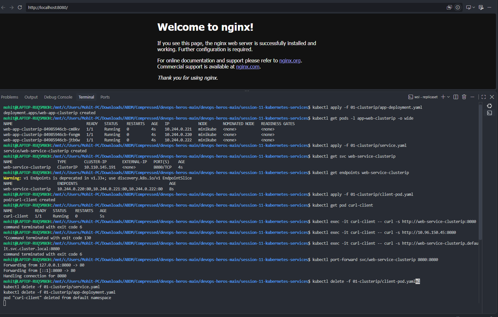
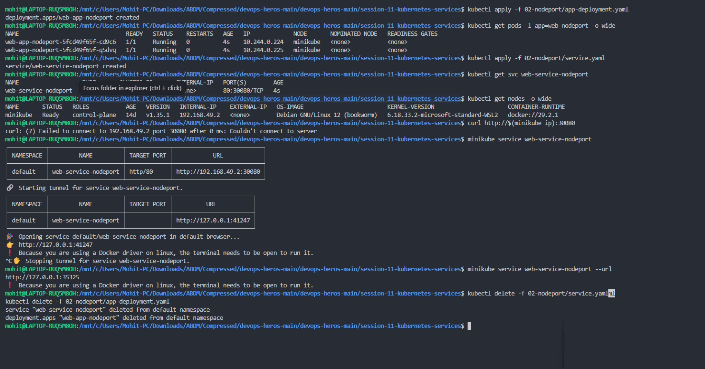
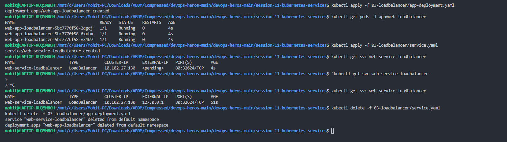
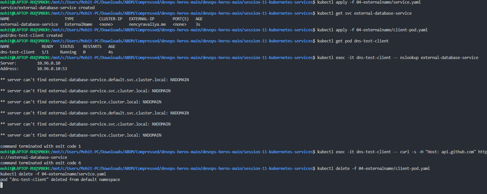
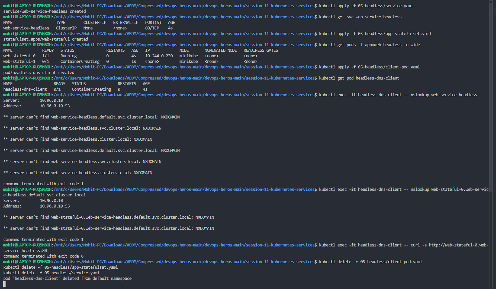

# Kubernetes Networking & Service Types

> **Session 11 — Kubernetes Services**
> **Name:** Mohit Sagar &nbsp;•&nbsp; **Enrollment:** 2024bcs10622
> **Cluster:** minikube v1.35.1 · k8s **v1.35.1** · Docker driver on WSL2 (`docker://29.2.1`)
> **Manifests:** [`../k8s/services/`](../k8s/services/)

---

## The five Service types at a glance

| Type | `CLUSTER-IP` | Reachable from | Use it for |
|------|--------------|----------------|------------|
| **ClusterIP** | allocated | inside the cluster only | internal APIs, databases — the default |
| **NodePort** | allocated | `<nodeIP>:30000-32767` | dev access, or behind an external LB |
| **LoadBalancer** | allocated | cloud LB external IP | public services on a cloud provider |
| **ExternalName** | `<none>` | DNS CNAME to an outside host | pointing at a managed DB / third-party API |
| **Headless** | `None` | direct pod IPs via DNS | StatefulSets, client-side load balancing |

| # | Task | Screenshot |
|:-:|------|------------|
| 1 | [ClusterIP](#1--clusterip) | `clusterip.png` |
| 2 | [NodePort](#2--nodeport) | `nodeport.png` |
| 3 | [LoadBalancer](#3--loadbalancer) | `loadbalancer.png` |
| 4 | [ExternalName](#4--externalname) | `externalname.png` |
| 5 | [Headless](#5--headless) | `headless.png` |

---

## 1 · ClusterIP

**Goal —** expose 3 nginx pods on a stable internal VIP and reach it from another pod by **DNS name**.

```bash
kubectl apply -f 01-clusterip/app-deployment.yaml
kubectl get pods -l app=web-clusterip -o wide
kubectl apply -f 01-clusterip/service.yaml
kubectl get svc web-service-clusterip
kubectl get endpoints web-service-clusterip

kubectl apply -f 01-clusterip/client-pod.yaml            # curlimages/curl:8.5.0
kubectl exec -it curl-client -- curl -s http://web-service-clusterip:8080
kubectl exec -it curl-client -- curl -s http://web-service-clusterip.default.svc.cluster.local:8080

kubectl port-forward svc/web-service-clusterip 8080:8080 # reach it from the browser
```



### Result

```
NAME                    TYPE        CLUSTER-IP       EXTERNAL-IP   PORT(S)    AGE
web-service-clusterip   ClusterIP   10.110.145.191   <none>        8080/TCP   4s

ENDPOINTS
10.244.0.220:80, 10.244.0.221:80, 10.244.0.222:80
```

Everything about the wiring is correct:

- **3 endpoints** — one per Running pod (`10.244.0.220/.221/.222`), all on node `minikube`.
- `EXTERNAL-IP <none>` — by design. A ClusterIP is deliberately unreachable from outside.
- **Port mapping works:** the Service listens on `8080`, the containers listen on `80` (`port: 8080 → targetPort: 80`).
- `kubectl port-forward` succeeded (`Forwarding from 127.0.0.1:8080 -> 80`, `Handling connection for 8080`) and the browser at **`http://localhost:8080`** rendered the **"Welcome to nginx!"** page — visible at the top of the screenshot. So the pods, the Service and the endpoints are all healthy.

### ⚠️ Errors in this screenshot

<details open>
<summary><b>1. <code>kubectl exec -it curl-client -- curl -s http://web-service-clusterip:8080</code> → <code>command terminated with exit code 6</code></b></summary>

**What exit code 6 means:** curl's `CURLE_COULDNT_RESOLVE_HOST`. The request never left the pod — **DNS failed**, the Service was never even dialled. The same happened for the fully-qualified name `web-service-clusterip.default.svc.cluster.local:8080`.

**Why it happened:** the Service and endpoints are provably fine (port-forward served nginx), so the failure is on the resolver side of the client pod. In order of likelihood:

1. **CoreDNS was not ready / not resolving at that moment.** The Service was 4 s old and `curl-client` 5 s old — the pod's `/etc/resolv.conf` was written at start-up, and if CoreDNS was still rolling it answers nothing.
2. **The pod was created before CoreDNS finished starting**, so it cached a failure.

**What should have been there:** the nginx welcome HTML — the exact same page the browser showed via port-forward.

**How to diagnose and fix it:**

```bash
# 1. is CoreDNS actually up?
kubectl get pods -n kube-system -l k8s-app=kube-dns
kubectl -n kube-system rollout status deploy/coredns

# 2. what does the pod think its resolver is?
kubectl exec curl-client -- cat /etc/resolv.conf
#    expect: nameserver 10.96.0.10 / search default.svc.cluster.local svc.cluster.local cluster.local

# 3. resolve before you curl
kubectl exec curl-client -- nslookup web-service-clusterip
#    expect: Address: 10.110.145.191

# 4. then the real test
kubectl exec curl-client -- curl -s http://web-service-clusterip:8080

# quick workaround while DNS is broken — dial the ClusterIP directly
kubectl exec curl-client -- curl -s http://10.110.145.191:8080
```
</details>

<details open>
<summary><b>2. <code>kubectl exec -it curl-client -- curl -s http://10.96.150.45:8080</code> → hung, killed with <code>^C</code> (exit code 130)</b></summary>

**Why it happened:** **wrong IP.** `10.96.150.45` is not this Service's ClusterIP — the real one is `10.110.145.191` (visible two commands earlier). `10.96.150.45` is an unallocated address in the Service CIDR, so no `kube-proxy` rule matches it, the SYN is silently dropped, and curl sits there until the TCP timeout. `^C` → exit 130 (128 + SIGINT).

**What should have been there:** the nginx HTML, from the correct address:

```bash
kubectl exec curl-client -- curl -s http://10.110.145.191:8080
# better still, never hard-code it:
CIP=$(kubectl get svc web-service-clusterip -o jsonpath='{.spec.clusterIP}')
kubectl exec curl-client -- curl -s --max-time 5 http://$CIP:8080
```

> **Tip:** always pass `--max-time 5` to curl in a cluster. A hang tells you *nothing*; a timeout tells you the packet is being dropped rather than refused.
</details>

<details>
<summary><b>3. <code>Warning: v1 Endpoints is deprecated in v1.33+; use discovery.k8s.io/v1 EndpointSlice</code></b></summary>

Informational only — the cluster is on v1.35.1, where the legacy `Endpoints` API is deprecated. The output shown is still accurate. Modern form: `kubectl get endpointslices -l kubernetes.io/service-name=web-service-clusterip`.
</details>

---

## 2 · NodePort

**Goal —** open the same app on a fixed port (`30080`) on every node.

```bash
kubectl apply -f 02-nodeport/app-deployment.yaml
kubectl get pods -l app=web-nodeport -o wide
kubectl apply -f 02-nodeport/service.yaml
kubectl get svc web-service-nodeport
kubectl get nodes -o wide

curl http://$(minikube ip):30080
minikube service web-service-nodeport          # opens a tunnel + browser
minikube service web-service-nodeport --url
```



### Result

```
NAME                   TYPE       CLUSTER-IP   EXTERNAL-IP   PORT(S)        AGE
web-service-nodeport   NodePort   10.x.x.x     <none>        80:30080/TCP   4s
```

`80:30080/TCP` is the giveaway — a NodePort keeps its ClusterIP **and** adds a node-wide port. Node details:

| Node | Status | Roles | Version | Internal IP | Runtime |
|------|--------|-------|---------|-------------|---------|
| `minikube` | Ready | control-plane | `v1.35.1` | `192.168.49.2` | `docker://29.2.1` |

`minikube service web-service-nodeport` did the right thing and printed both mappings:

| | URL |
|---|---|
| What the cluster sees | `http://192.168.49.2:30080` |
| What **you** can reach | `http://127.0.0.1:41247` ← tunnel |

### ⚠️ Error in this screenshot

<details open>
<summary><b><code>curl http://$(minikube ip):30080</code> → <code>curl: (7) Failed to connect to 192.168.49.2 port 30080</code></b></summary>

**Why it happened:** minikube uses the **Docker driver**, so `192.168.49.2` belongs to Docker's internal bridge network inside WSL2. There is no route from the host shell to it. The Service is fine — the *path* to it does not exist. (On a VM driver such as `hyperv` or `virtualbox`, this exact command works, which is why it is in every tutorial.)

**What should have been there:** the nginx HTML.

**How to get it — and minikube told you so:**

```
🏃  Starting tunnel for service web-service-nodeport.
❗  Because you are using a Docker driver on linux, the terminal needs to be open to run it.
```

```bash
minikube service web-service-nodeport --url     # -> http://127.0.0.1:35325
# leave THAT terminal open, then in a second terminal:
curl http://127.0.0.1:35325

# or the portable way:
kubectl port-forward svc/web-service-nodeport 8080:80
curl http://localhost:8080
```

Note the tunnel port changes each time (`41247`, then `35325`) — it is random, never `30080`. The `^C` in the screenshot stopped the first tunnel, which is why the URL from it stopped working.
</details>

---

## 3 · LoadBalancer

**Goal —** request a cloud load balancer and watch what happens without a cloud provider.

```bash
kubectl apply -f 03-loadbalancer/app-deployment.yaml
kubectl get pods -l app=web-loadbalancer
kubectl apply -f 03-loadbalancer/service.yaml
kubectl get svc web-service-loadbalancer        # EXTERNAL-IP: <pending>
# in a second terminal:  minikube tunnel
kubectl get svc web-service-loadbalancer        # EXTERNAL-IP: 127.0.0.1
```



### Result — the `<pending>` → IP transition

| Time | `EXTERNAL-IP` | Meaning |
|------|---------------|---------|
| `4s` | `<pending>` | No cloud controller has claimed the Service yet |
| `51s` | `127.0.0.1` | `minikube tunnel` acted as the "cloud provider" and assigned one |

```
NAME                       TYPE           CLUSTER-IP     EXTERNAL-IP   PORT(S)        AGE
web-service-loadbalancer   LoadBalancer   10.102.27.130  <pending>     80:32624/TCP   4s
web-service-loadbalancer   LoadBalancer   10.102.27.130  127.0.0.1     80:32624/TCP   51s
```

**`<pending>` is not a bug.** A `LoadBalancer` Service is a *request* to a cloud-controller-manager. On EKS/GKE/AKS it provisions a real ELB/NLB and fills in a public IP; on a bare cluster nothing answers, so it pends forever. That is exactly why **MetalLB** exists for on-prem clusters.

Also note the type is a superset stack: `LoadBalancer` still owns a ClusterIP (`10.102.27.130`) **and** a NodePort (`32624`) underneath.

### ⚠️ Error in this screenshot

<details open>
<summary><b>A stray backtick — <code>`kubectl get svc web-service-loadbalancer</code> → shell dropped to a <code>&gt;</code> continuation prompt</b></summary>

**Why it happened:** a leading **backtick** (`` ` ``) opened a legacy command substitution. Bash then waited for the closing backtick, showing `>` on the next line; `^C` was needed to escape. Nothing reached Kubernetes at all.

**What should have been there:** just the plain command —

```bash
kubectl get svc web-service-loadbalancer
```

To actually watch the transition instead of re-running it by hand:

```bash
kubectl get svc web-service-loadbalancer -w
```
</details>

---

## 4 · ExternalName

**Goal —** create a Service that is nothing but a **DNS CNAME** to a host outside the cluster.

```bash
kubectl apply -f 04-externalname/service.yaml
kubectl get svc external-database-service
kubectl apply -f 04-externalname/client-pod.yaml
kubectl exec -it dns-test-client -- nslookup external-database-service
kubectl exec -it dns-test-client -- curl -s -H "Host: api.github.com" https://external-database-service
```



### Result

```
NAME                       TYPE           CLUSTER-IP   EXTERNAL-IP        PORT(S)   AGE
external-database-service  ExternalName   <none>       nencyravaliya.me   <none>    3s
```

The Service object itself is **correct and behaving as designed**:

- `CLUSTER-IP: <none>` — an ExternalName has no VIP, no endpoints, no `kube-proxy` rules.
- `PORT(S): <none>` — it does no port mapping; the client must supply the port.
- Everything it does happens in CoreDNS, which returns a `CNAME` instead of an `A` record.

### ⚠️ Errors in this screenshot

<details open>
<summary><b>1. <code>nslookup external-database-service</code> → <code>NXDOMAIN</code> on every search-domain suffix (exit code 1)</b></summary>

```
Server:   10.96.0.10          <- CoreDNS answered, so DNS itself is UP
** server can't find external-database-service.default.svc.cluster.local: NXDOMAIN
** server can't find external-database-service.svc.cluster.local: NXDOMAIN
** server can't find external-database-service.cluster.local: NXDOMAIN
```

**Why it happened:** CoreDNS *did* return the CNAME `external-database-service.default.svc.cluster.local → nencyravaliya.me`, then tried to resolve **that** target upstream. `nencyravaliya.me` has no resolvable `A` record from the cluster's upstream resolver, so the chain terminates in `NXDOMAIN` and `nslookup` reports the failure against the original name. In short: **the Service is right, the target hostname is wrong.**

This is the tell-tale difference from a broken-DNS failure: CoreDNS answered at `10.96.0.10:53` (it was reached), it just had nothing to hand back.

**What should have been there:** a CNAME chain ending in real addresses —

```
Name:     external-database-service.default.svc.cluster.local
Address:  140.82.121.6
Aliases:  api.github.com
```

**Fix — point `externalName` at a host that actually resolves:**

```yaml
apiVersion: v1
kind: Service
metadata:
  name: external-database-service
spec:
  type: ExternalName
  externalName: api.github.com     # must be a real, resolvable FQDN
```

```bash
kubectl apply -f 04-externalname/service.yaml
kubectl exec dns-test-client -- nslookup external-database-service
# sanity-check the target on its own first:
kubectl exec dns-test-client -- nslookup nencyravaliya.me
```
</details>

<details open>
<summary><b>2. <code>curl -s -H "Host: api.github.com" https://external-database-service</code> → <code>exit code 6</code></b></summary>

**Why it happened:** the direct consequence of error 1 — exit 6 is curl's "couldn't resolve host". The `-H "Host: …"` header only rewrites the HTTP `Host:` header; it cannot help curl find an IP, and it does not fix TLS SNI either.

**What should have been there:** the GitHub API JSON (`{"current_user_url":"https://api.github.com/user", …}`).

**After fixing `externalName`, the correct call is:**

```bash
kubectl exec dns-test-client -- curl -s https://external-database-service
```

No `Host:` header needed — once `externalName: api.github.com`, DNS delivers you to the right server and TLS validates against the real name.

> **Gotcha to remember:** `ExternalName` + `https` is awkward precisely because the certificate is issued for the *external* name, not for `external-database-service`. It is the natural fit for plain-TCP backends (a managed MySQL/Postgres endpoint), which is the use case it was designed for.
</details>

---

## 5 · Headless Service

**Goal —** `clusterIP: None` + a StatefulSet, so DNS returns **individual pod IPs** and each pod gets its own stable hostname.

```bash
kubectl apply -f 05-headless/service.yaml
kubectl get svc web-service-headless            # CLUSTER-IP: None
kubectl apply -f 05-headless/app-statefulset.yaml
kubectl get pods -l app=web-headless -o wide

kubectl apply -f 05-headless/client-pod.yaml
kubectl exec -it headless-dns-client -- nslookup web-service-headless
kubectl exec -it headless-dns-client -- nslookup web-stateful-0.web-service-headless.default.svc.cluster.local
kubectl exec -it headless-dns-client -- curl -s http://web-stateful-0.web-service-headless:80
```



### Result

```
NAME                   TYPE        CLUSTER-IP   EXTERNAL-IP   PORT(S)   AGE
web-service-headless   ClusterIP   None         <none>        80/TCP    4s
```

`CLUSTER-IP: None` is the whole definition of headless — no VIP, no `kube-proxy` rules. DNS hands the client every ready pod IP and the client chooses.

StatefulSet pods come up **ordinally**, one at a time, with stable names (not random hashes):

```
NAME              READY  STATUS             IP             NODE
web-stateful-0    1/1    Running            10.244.0.230   minikube
web-stateful-1    0/1    ContainerCreating  <none>         minikube   <- no IP yet
```

### ⚠️ Errors in this screenshot

<details open>
<summary><b>1. <code>nslookup web-service-headless</code> → <code>NXDOMAIN</code> (exit code 1)</b></summary>

**Why it happened — timing.** A headless Service publishes DNS records only for endpoints that are **Ready**. Look at the ages in the screenshot: the Service was **4 s** old, `web-stateful-1` was still `ContainerCreating` with **no IP**, and the client pod `headless-dns-client` was itself `0/1 ContainerCreating` 4 s earlier. The lookups ran before the StatefulSet had settled, so there was nothing to return and CoreDNS correctly answered `NXDOMAIN`.

(By default `publishNotReadyAddresses` is `false` — not-ready pods are deliberately hidden from DNS.)

**Secondary suspect worth checking:** the headless Service's `selector` must match the StatefulSet's pod labels, and `spec.serviceName` in the StatefulSet **must** equal `web-service-headless` — per-pod DNS records are not created otherwise.

**What should have been there:** one `A` record per ready pod —

```
Name:    web-service-headless.default.svc.cluster.local
Address: 10.244.0.230
Address: 10.244.0.231      <- multiple A records, no VIP
```

**Fix — wait for readiness first, then look up:**

```bash
kubectl rollout status statefulset/web-stateful --timeout=120s
kubectl get pods -l app=web-headless -o wide          # all should be 1/1
kubectl get endpoints web-service-headless            # must list IPs before DNS will
kubectl exec headless-dns-client -- nslookup web-service-headless
```

Also confirm the wiring:

```bash
kubectl get statefulset web-stateful -o jsonpath='{.spec.serviceName}{"\n"}'   # -> web-service-headless
kubectl get svc web-service-headless -o jsonpath='{.spec.selector}{"\n"}'      # -> {"app":"web-headless"}
```
</details>

<details open>
<summary><b>2. <code>nslookup web-stateful-0.web-service-headless.default.svc.cluster.local</code> → <code>NXDOMAIN</code></b></summary>

**Why it happened:** same root cause. The per-pod record `<pod>.<service>.<ns>.svc.cluster.local` exists only when (a) the pod is Ready and (b) the StatefulSet's `serviceName` points at this headless Service.

**What should have been there:**

```
Name:    web-stateful-0.web-service-headless.default.svc.cluster.local
Address: 10.244.0.230
```

That per-pod hostname is the entire reason StatefulSets pair with headless Services: `web-stateful-0` is always reachable at the same name even after a reschedule onto a new IP — which is how database replicas find their primary.
</details>

<details open>
<summary><b>3. <code>curl -s http://web-stateful-0.web-service-headless:80</code> → <code>exit code 6</code></b></summary>

**Why it happened:** DNS had nothing to give (errors 1 and 2), so curl could not resolve the host and never opened a socket.

**What should have been there:** the nginx welcome HTML, served by that one specific pod. After the rollout completes:

```bash
kubectl exec headless-dns-client -- curl -s http://web-stateful-0.web-service-headless
kubectl exec headless-dns-client -- curl -s http://web-stateful-1.web-service-headless
```

Each call hits a *named, individual* pod — no load balancing involved. That is the difference from ClusterIP in one line.
</details>

---

## Errors summary

| # | Error | Root cause | Fix |
|:-:|-------|------------|-----|
| 1 | `curl: (7)` to `$(minikube ip):30080` | Docker driver — node IP not routable from host | `minikube service --url` (keep open) or `kubectl port-forward` |
| 2 | `exit code 6` on ClusterIP DNS | Name could not be resolved from the client pod | Check CoreDNS is Ready, `nslookup` before `curl` |
| 3 | `curl` hang → `exit 130` | Dialled `10.96.150.45`, an IP no Service owns | Use the real ClusterIP `10.110.145.191`, always pass `--max-time` |
| 4 | Shell `>` prompt | Stray leading backtick | Retype without it |
| 5 | `NXDOMAIN` on ExternalName | `nencyravaliya.me` does not resolve upstream | Point `externalName` at a real FQDN |
| 6 | `NXDOMAIN` on headless | Looked up 4 s in, pods not Ready yet | `kubectl rollout status statefulset/...` first |

**Two habits that would have prevented five of the six:**

1. **Wait for Ready before you test.** `kubectl rollout status`, or check `kubectl get endpoints` — no endpoints means no DNS and no traffic, every time.
2. **Read the exit code.** curl `7` = couldn't connect (DNS was fine, the network path is broken). curl `6` = couldn't resolve (the request never left the pod — it's a DNS problem). Those two numbers point at completely different layers.

---

## Cleanup

```bash
kubectl delete -f 01-clusterip/ -f 02-nodeport/ -f 03-loadbalancer/ -f 04-externalname/ -f 05-headless/ --ignore-not-found
kubectl get svc
```
