# Session 14 — Kubernetes Troubleshooting

**Name:** Mohit Sagar &nbsp;•&nbsp; **Enrollment:** 2024bcs10622
**Cluster:** minikube v1.35.1 (Docker driver, WSL2)

---

### 1 · kubectl get — pods, services, nodes, all
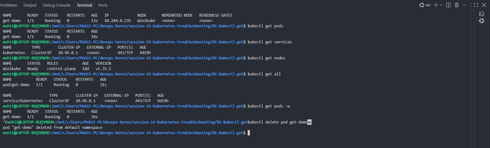

### 2 · kubectl describe — pod details and events
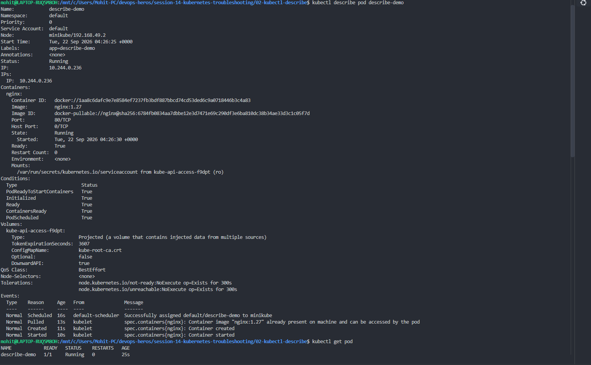

### 3 · kubectl logs — logs, follow, previous, per-container
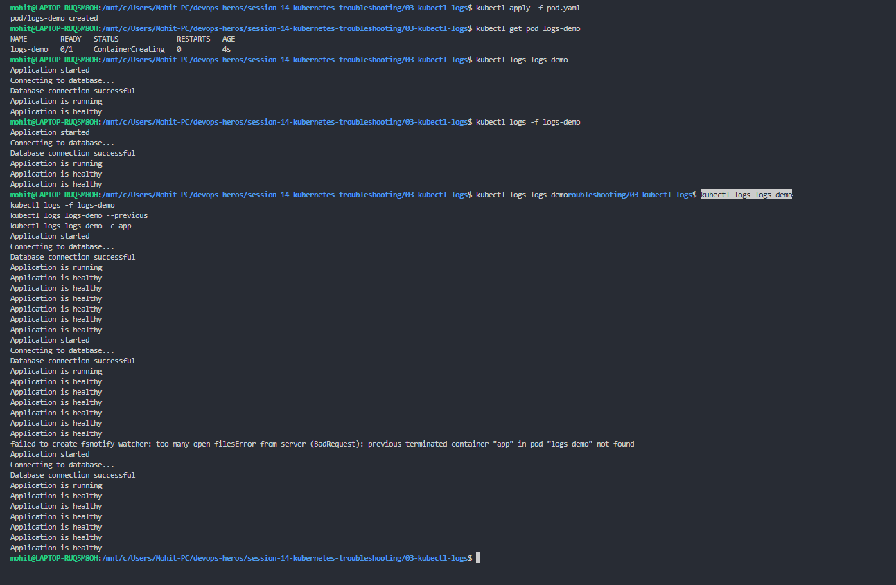

### 4 · kubectl exec — shell into the pod, curl localhost, `nginx -T`
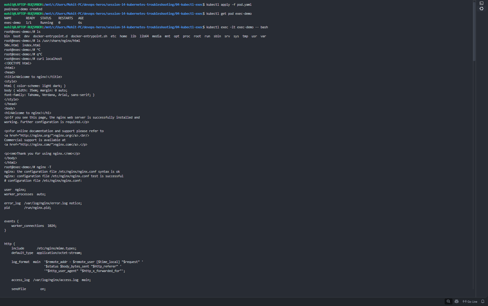

### 5 · kubectl exec — nginx default.conf and non-interactive exec
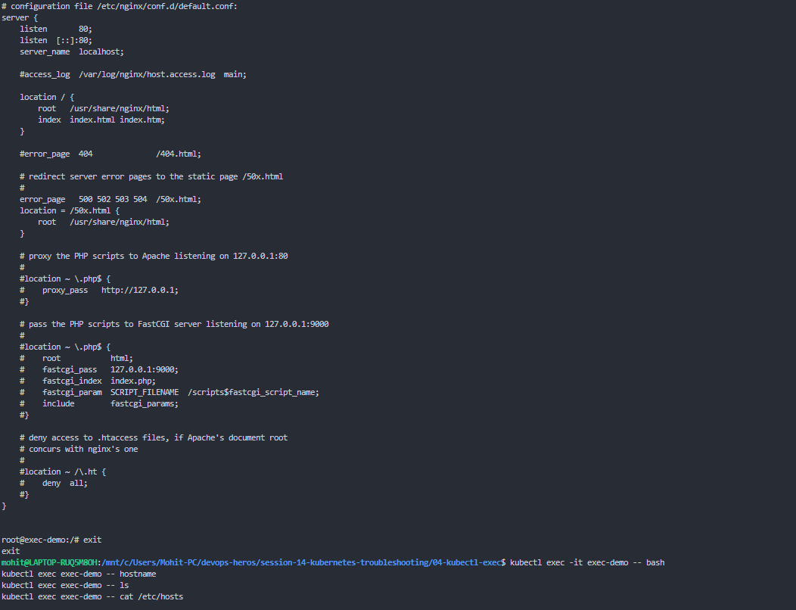

### 6 · kubectl get events — sorted by timestamp
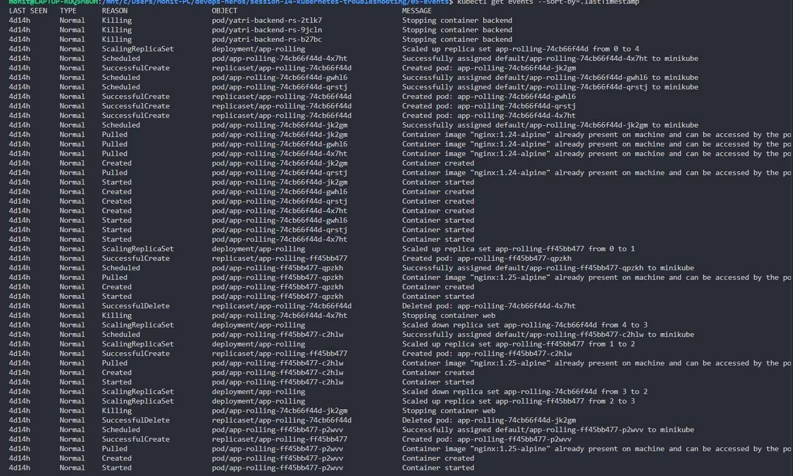

### 7 · CrashLoopBackOff — container exits 1 and keeps restarting
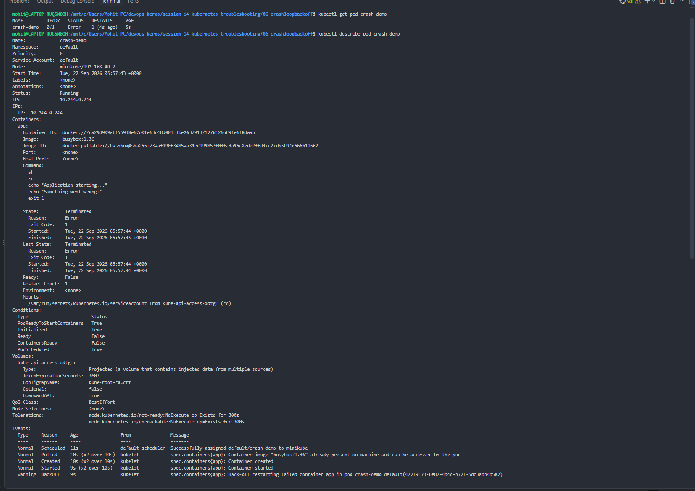

### 8 · ImagePullBackOff — image tag does not exist
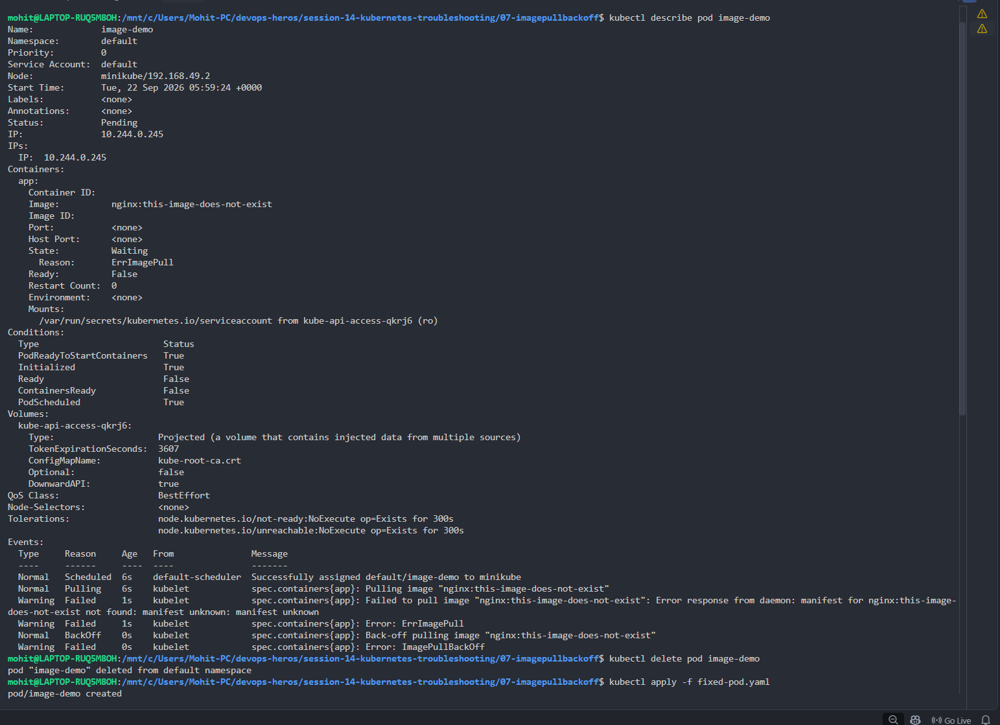

### 9 · Pending pod — nodeSelector matches no node
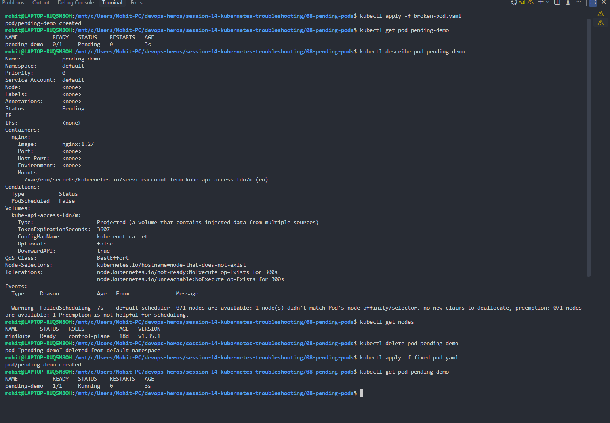

### 10 · Service & DNS troubleshooting — endpoints, selectors
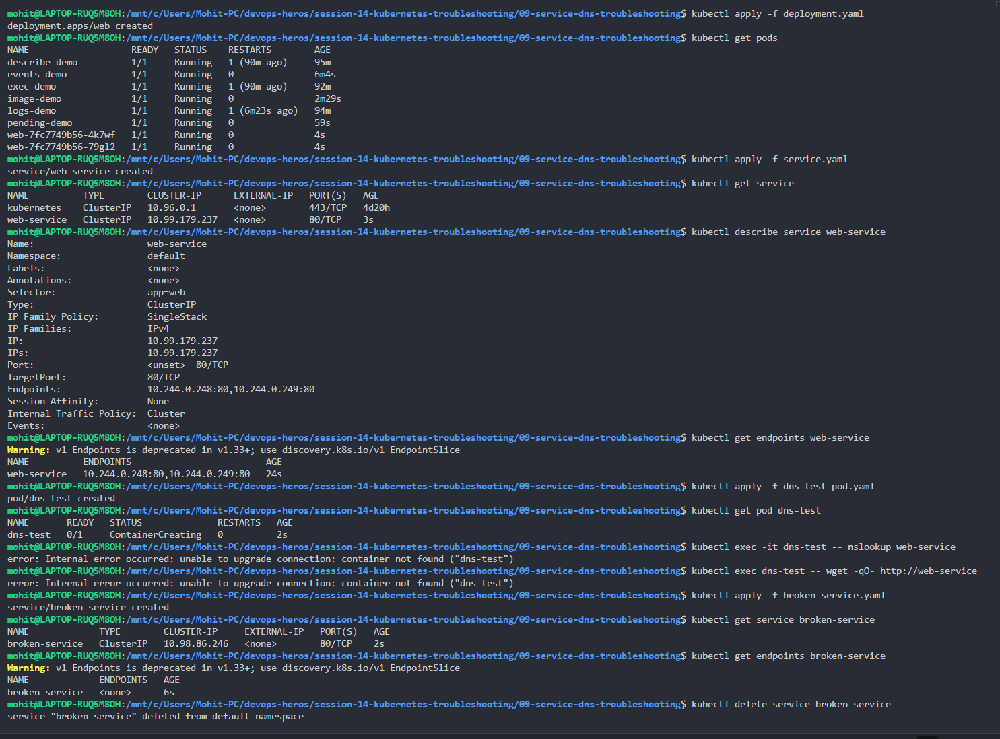

### 11 · Mini project — deployment, service, endpoints, broken pod
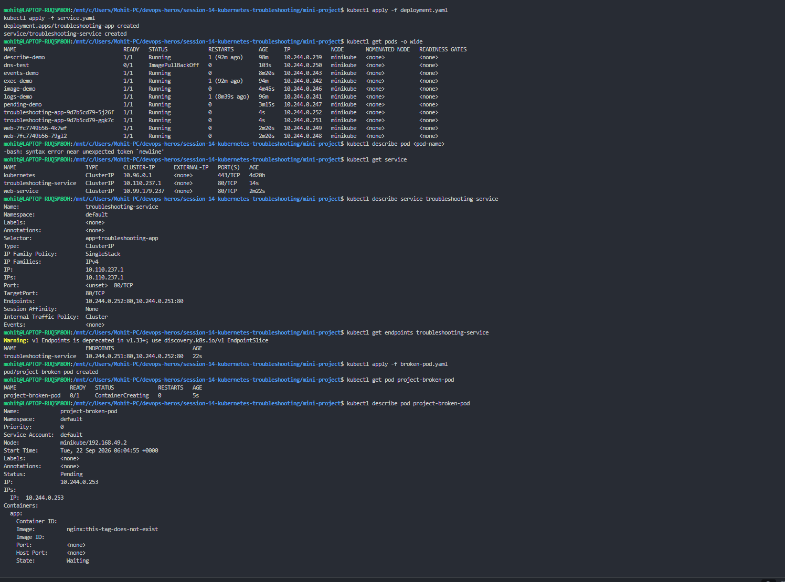

### 12 · Mini project — describe project-broken-pod
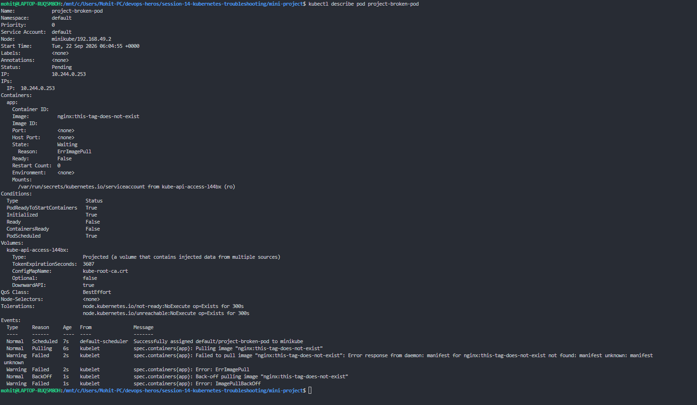

---

## Questions

**Question 1: What is the Pod status?**
`Pending` / `0/1 ImagePullBackOff` — the container state is `Waiting` with reason `ErrImagePull`, then `ImagePullBackOff`.

**Question 2: What is the actual error?**
`Failed to pull image "nginx:this-tag-does-not-exist": Error response from daemon: manifest for nginx:this-tag-does-not-exist not found: manifest unknown`

**Question 3: Which command helped you find the reason?**
`kubectl describe pod project-broken-pod` — the **Events** section at the bottom shows the real pull error (`kubectl get pod` only shows `ImagePullBackOff`).

**Question 4: What is wrong with the image?**
The tag doesn't exist in the registry. The repository `nginx` is valid, but `this-tag-does-not-exist` is not a published tag, so the manifest can't be resolved.

**Question 5: How would you fix it?**
Use a real tag, then recreate the pod:

```bash
kubectl delete pod project-broken-pod
# image: nginx:1.27   (valid tag)
kubectl apply -f fixed-pod.yaml
kubectl get pod project-broken-pod
```
